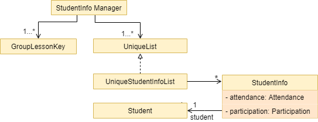

* Table of Contents
{:toc}

--------------------------------------------------------------------------------------------------------------------

## **1. Introduction**


--------------------------------------------------------------------------------------------------------------------

## **2. Setting up, getting started**

Refer to the guide [_Setting up and getting started_](SettingUp.md).

## **3. Design**

### **3.1 Architecture**

### **3.2 UI Component**

### **3.3 Logic component**

### **3.4 Model Component**

### **3.5 Storage Component**

### **3.6 Common Classes**

## **4. Implementation** 

### **4.1 Feature Managers**

### **4.2 Group Manager**

### **4.3 Lesson Manager**

### **4.4 Student Manager**

### **4.5 StudentInfo Manager**

(contributed by Xin Yee)

Serenity allows users to keep track of the attendance and participation of students from his/her tutorial lessons. 

The StudentInfo manager is one of the `Feature Manager`s (See [Feature-Manager](#41-feature-managers)). 
The StudentInfoManager helps to collate all the information related to the student, consisting of the student’s 
attendance as well as participation score for each lesson. 
It contains a UniqueStudentInfoList which contains all the studentInfo of every student for each lesson.

#### **4.5.1. Rationale**

The studentInfo manager is an important feature to have because a tutor has to keep track of both the attendance 
as well as participation of every student. By putting the things to track under studentInfo, it will be much 
easier for the teacher to track and is much more organised.

#### **4.5.2. Current Implementation**
The StudentInfo Manager contains a HashMap whose key is a GroupLessonKey and value is a UniqueList. 
The following Class Diagram describes the structure of StudentInfoManager and its relevant classes.

<p align="center"></p>
<p align="center"><i>Figure 4.5.2.1. Simplified class diagram of a StudentInfo Manager and relevant classes</i></p>

From the diagram above, we can see that StudentInfoManager can contain multiple GroupLessonKey as well as 
UniqueStudentInfoList for each GroupLessonKey. The table below shows the commands managed by the StudentInfoManager.

Commands | Purpose
-------|--------
markpresent / markabsent | Mark student present / absent during a lesson
flagatt / unflagatt | Flag the attendance of a student for special scenarios
setscore | Set the participation score of a student for a lesson 
 
In this section, we will outline the `markpresent` command handled by the StudentInfoManager which is summarised by the Activity Diagram below. 
We will be using the index version of the markpresent command.

<p align="center"></p>
<p align="center"><i>Figure 4.5.2.2 Activity Diagram of a <code>markpresent</code> command by index</i></p>

When the user enters the `markpresent` command followed by an index to mark a student in a lesson present, 
the user input command undergoes the parsing to retrieve the index. 
The following steps will describe the execution of the MarkPresentCommand by INDEX,  assuming that no error is encountered.

1. When the `execute()` method of the `MarkPresentCommand` is called, the `GroupLessonKey` is retrieved to obtain the 
`UniqueStudentInfoList` from the HashMap. 
2. The `StudentInfoManager` then checks whether the index is valid and marks the student present if it is valid.
3. Afterwards, the `StudentInfoManager` will update the `UniqueStudentInfoList`.
4. The `Ui` component will detect this change and update the 
<span ><a href="#appendix-e-glossary" style="color:purple"><i>Graphical User Interface (GUI)</i></a></span>.
5. If the above steps are all successful, a successful message will be displayed on the
<span ><a href="#appendix-e-glossary" style="color:purple"><i>Graphical User Interface (GUI)</i></a></span>.

*If the index is not valid, an error will be thrown to prompt the user to choose another index.

#### **4.5.3. Design Consideration**
**Aspect:** Deciding between retrieving StudentInfo through deep nesting methods or using HashMap to retrieve studentInfo with GroupLessonKey.

|   |**Pros**|**Cons**|
|---|---|---|
| **Option 1**<br>Reach into Group, followed by Lesson to retrieve StudentInfo. | More intuitive. | Nesting of data makes it harder to test. 
| **Option 2 (current)**<br>Store and retrieve StudentInfo from a HashMap with Group and Lesson name making up the key. | Easier to retrieve data. <br> <br> Less nesting of data allows testing to be done more easily. | Need to put in more thought into coming up with the Manager structures to prevent cyclic dependencies. |

**Reasons for choosing option 2:**

* We originally used Option 1. However, deep nesting of data is a very worrying problem as it makes it hard to test the code and increases the chances of
the code breaking if any intermediate classes are not functioning properly. 
* Option 2, despite being more complicated, solves our problem without adding much overhead. Thus, we decided option 2 is better.

### **4.6 Question Manager**

Serenity allows the user to keep track of the questions asked from his/her tutorial lessons for each tutorial group.
 
The question manager is one of the `Feature Manager`s (See [Feature-Manager](#41-feature-managers)). 
On top of the basic operations provided above it also allows the user to find questions by keywords using the `findqn` 
command. The `findqn` command does not restrict users to find via only one keyword. They are able to find via multiple 
keywords, similar to a search bar. E.g. `findqn deadline report` will search and list all question entries with 
`deadline` and `report` in the `Question`'s description.

#### **4.6.1. Rationale**

The question manager is an important feature to have because in any tutorial lesson, students will be asking tutors 
many questions, verbally or through virtual means such as Whatsapp or Telegram. Thus, we decided to create a question 
manager to manage and track all the questions asked during lessons.

#### **4.6.2. Current Implementation**

The current implementation of the question manager only allows the user to keep track of a list of questions for each 
of the lessons for each tutorial group. It does not allow the user to add questions without a tutorial group and lesson.
 
In this section, we will outline the `findqn` command of the question manager which is summarised by the 
Activity Diagram below.


<p align="center"></p>
<p align="center"><i>Figure 4.6.2.1. Activity diagram of a <code>findqn</code> command</i></p>

When the user enters the `findqn` command to search for questions, the user input command undergoes the same command
parsing as described in [Design-Logic](#33-logic-component). During the parsing, a predicate is created. This predicate 
checks if a given `Question`'s description contains the user input keywords. The `FindQnCommand` will then receive 
this predicate when it is created.

The following steps will describe the execution of the `FindQnCommand` in detail, assuming that no error is encountered.

1. When the `execute` method of the `FindQnCommand` is called, the `ModelManager`’s `updateFilteredQuestionList` method is called.
2. The `ModelManager` will then update its filtered list of `Question`'s to contain only `Question`'s that fulfil the given predicate.
3. The Ui component will detect this change and update the <span style="color:purple"><i>GUI</i></span>.
4. If the above steps are all successful, the `FindQnCommand` will then create a `CommandResult` object and return the result.

The Sequence Diagram below summarises the aforementioned steps.

<p align="center"></p>
<p align="center"><i>Figure 4.6.2.2. Sequence diagram detailing execution of <code>FindQnCommand</code></i></p>

#### **4.6.3. Design Consideration**

**Aspect:** Deciding between storing a question in a global question list and a lesson-specified question list.

|   |**Pros**|**Cons**|
|---|---|---|
| **Option 1 (Current)**<br>To store the questions to a global question list. | Better user experience as the user is able to see the full list of questions from every lesson.<br><br>Reduce data nesting as the list of questions are abstracted out as a separate component. | Complicated to filter out questions for a specific tutorial group and lesson. |
| **Option 2**<br>To store the questions in a list in each lesson. | Straight-forward and easier to implement.|Difficult to sieve through each lesson to collate all the questions from every group to display. |

**Reasons for choosing option 1:**

* The question feature is a key feature in our application. Thus, we decided to opt for the option with better user experience.
* Both options have overheads when trying to view all questions and to view an individual lesson’s questions. However, option 2 is more costly and complicated to implement given the time constraints. Thus, we decided option 1 is better.


## **Appendix A: Product Scope**

**Target user profile:**
* Has a need to manage a significant number of students from various CS2101 classes
* Has a need to keep track of the students' attendance throughout the semester
* Has a need to keep track of the students' participation throughout the semester
* Likes to keep track of the students' unanswered questions
* Likes to handle most administrative work via one platform
* Prefer desktop apps over other types
* Can type fast
* Prefers typing to mouse interactions
* Is reasonably comfortable using CLI apps

**Value proposition:** 
* Serenity can help assist the management of a CS2101 class faster than a typical mouse / 
 <span ><a href="#appendix-e-glossary" style="color:purple"><i>Graphical User Interface (GUI)</i></a></span> driven app through easy reference and editing of class data.
* Serenity consolidates administrative information on a 
 <span ><a href="#appendix-e-glossary" style="color:purple"><i>Graphical User Interface (GUI)</i></a></span>
 for convenient viewing.
* Serenity gives the tutor ability to export data which can be used in other software, e.g. Microsoft Excel.

## **Appendix B: User Stories**

As a... | I want to... | So that I can...
| ------------- | ------------- | ------------- |
Tutor | Set up tutorial groups that I am teaching at the start of every semester | Perform administrative functions more efficiently
Tutor | Mark attendance across every lesson | Grade effectively at the end of the term
Tutor | Flag the attendance of a student | Be reminded to check up on this student after lesson
Tutor | View the attendance sheet for each class | Identify the students who did not attend a lesson
Tutor | Export attendance of all my tutorial groups as a XLSX file | Submit attendance as a softcopy to the school
Tutor | Use a participation system to keep track of participation | Grade effectively at the end of the term
Tutor | Give a participation score to a student | Grade the student's participation
Tutor | Generate the average score for each student across each session | Have an additional set of data to cross reference to
Tutor | Export participation scores of each class as a XLSX file | Submit it as a softcopy for marks generation
Tutor | Add a question to the question list | Be reminded to answer the question after the lesson ends
Tutor | Remove a question from the question list | Prevent the list from becoming too cluttered
Tutor | View the list of questions for each class | Identify the questions that I have not answered in class
Tutor | Mark the question that I have addressed as answered | Avoid re-addressing the same question in class
Tutor | Import data of my students | Avoid manually entering the data
Tutor | Access the list of commands easily on the software without referring to the user guide | Operate the software easily while teaching in class
Tutor | Use an app that does not take up too much screen space | Continue to teach the content effectively
Tutor | The list of commands to be as short as possible | Be productive trying to recall more important things for the lesson


## **Appendix C: Use Cases**
For all use cases below, the System is `Serenity` and the Actor is the `User`, unless specified otherwise.

```
UC01: Set up tutorial group

System: Serenity
Actor: User

Guarantees:
    - The tutorial group is added to the tutorial group list upon successful command.
    - Students are added to the student list in the respective tutorial groups upon successful command.

MSS:
    1. User chooses a csv file to upload.
    2. User adds the csv file in the same folder as the JAR file.
    3. Serenity reads the csv file.
    4. Serenity adds the tutorial groups and students to the respective lists.
Use case ends.
```


## **Appendix D: Non Functional Requirements**

1. Should work on any <span style="color:purple"><i>mainstream OS</i></span> as long as it has Java 11 or above installed.
2. Should be able to hold up to 30 students per tutorial group and up 10 tutorial groups without a noticeable sluggishness in performance for typical usage.
3. A user with above average typing speed for regular English text (i.e. not code, not system admin commands) should be able to accomplish most of the tasks faster using commands than using the mouse.


## **Appendix E: Glossary**

## **Appendix F: Instructions for Manual Testing**

Given below are instructions to test the app manually.
> :memo: Note: These instructions only provide a starting point for testers to work on; 
>testers are expected to do more **exploratory** testing.

**Launch and Shutdown**
 1. Initial launch
    1. Download the jar file and copy into an empty folder
    1. Double-click the jar file Expected: Shows the <span ><a href="#appendix-e-glossary" style="color:purple"><i>Graphical User Interface (GUI)</i></a></span> with a set of sample contacts. The window size may not be optimum.
 1. Saving window preferences
    1. Resize the window to an optimum size. Move the window to a different location. Close the window.
    1. Re-launch the app by double-clicking the jar file.
    1. Expected: The most recent window size and location is retained.

 
**Adding/Setting**

Add a new tutorial group in Serenity.
 1. Prerequisites: XLSX file must be in the same folder as `Serenity`
 1. Test case: `addgrp grp grp/<NAME OF TUTORIAL GROUP> path/<NAME OF FILE>.xlsx`
    1. Expected: Tutorial group created, <span style="color:purple"><i>GUI</i></span> updates to show the tutorial lessons specified in the XLSX file.
 1. Other incorrect add group commands to try: `addgrp`, `addgrp grp/<NAME OF TUTORIAL GROUP>`, `addgrp path/<NAME OF FILE>.csv`
    1. Expected: Error message shown.
 
Adding Lesson to a Group
1. Prerequisites: Tutorial group is already set up, lesson name to be added does not already exist in the group.
1. Test case: `addlsn grp/<NAME OF TUTORIAL GROUP> lsn/<LESSON NAME TO ADD>`
    1. Expected: Tutorial lesson added, <span style="color:purple"><i>GUI</i></span> updates to show the new tutorial lesson created.
 1. Other incorrect add group commands to try: `addlsn`, `addlsn grp/<NAME OF TUTORIAL GROUP>`, `addlsn lsn/<LESSON NAME TO ADD>`
    1. Expected: Error message shown.
 
Adding Student to a Group
1. Prerequisites: Tutorial group is already set up.
1. Test case: `addstudent grp/<NAME OF TUTORIAL GROUP> name/<NAME OF STUDENT TO ADD> matric/<MATRICULATION NUMBER OF STUDENT>`
    1. Expected: Success message shown: `You added <Student name> to <Tutorial Group>.`
 1. Other incorrect add group commands to try: `addstudent`, `addstudent grp/<NAME OF TUTORIAL GROUP>` `addstudent name/<NAME OF STUDENT>`
    1. Expected: Error message shown.
 	

**Data**

Missing data files
1. Test case: In the folder where Serenity is stored, delete `serenity.json` in `data` folder 
    1. Expected: New tutorial group G01 created with two students, Aaron Tan and John Doe.
    
**Editing**


