* Table of Contents
{:toc}

<div style="page-break-after: always"></div>

## **1. Introduction**

<p></p>

(Contributed by Bu Wen Jin)

**Serenity** is a desktop lesson management application made for CS2101 tutors who want to manage and reduce administrative work.
It focuses on the <span><a href="#appendix-e-glossary" style="color:purple"><i>Command Line Interface (CLI)</i></a></span>
while providing users with a simple and clean <span ><a href="#appendix-e-glossary" style="color:purple"><i>Graphical User Interface (GUI)</i></a></span>.
Thus, the main interaction with **Serenity** will be done through commands.

**Serenity** allows tutors to keep track of their lessons administrative work in a single,
simple-to-use platform. The information that can be managed by **Serenity** includes:

* Tutorial group details
* Tutorial lesson details
* Student name and matriculation number
* Student attendance and class participation scores for each lesson
* Questions asked in each lesson

The purpose of this Developer Guide is to help you understand the design
and implementation of **Serenity** so that you can get started on your contributions to **Serenity**.

## **2. Setting Up**

Refer to the [_Setting Up_](SettingUp.md) guide.

## **3. About**

(Contributed by Neo Rui En)

This section elaborates on structure and the symbols and syntax used in this Developer Guide.

### 3.1. Structure Of This Document

This Developer Guide has been structured such that you can easily find what you need.

In [Section 3.2](#32-general-symbols-and-syntax), you can find the meaning of the symbols and syntax used
in this document.

In [Section 4](#4-design), you can find the details of the components used in **Serenity**.

In [Section 5](#5-implementation), you can find the rationale, current implementation and design considerations
of our code.

In [Section 6](#6-documentation-logging-testing-configuration-dev-ops), you can find the details regarding
documentation, logging, testing, configuration and dev-ops.

From [Appendix A](#appendix-a-product-scope) to [Appendix G](#appendix-g-effort), you can find the additional
information relating to **Serenity**.

### 3.2. General Symbols And Syntax

The table below explains the general symbols and syntax used throughout the document.

Symbol/syntax | Meaning
--------|------------------
`command` | This indicates a technical term.
_GUI_ | This indicates a graphical component.
:information_source: | This indicates a note.
:bulb: | This indicates a tip.

## **4. Design**

This section describes the details of the components used in **Serenity**.

### 4.1. Architecture

(Contributed by Neo Rui En)

The Architecture Diagram given in Figure 4.1.1 below explains the high-level design of Serenity.

<p align="center">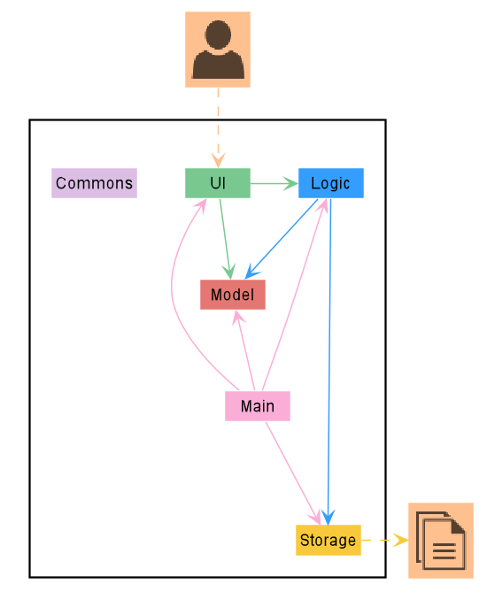</p>

<p align="center">Figure 4.1.1 Architecture Diagram of Serenity</p>

<div markdown="block" class="alert alert-primary">

:bulb: **TIP:** The .puml files used to create diagrams in this document can be found in the *diagrams* folder.

</div>

The following table gives a quick overview of each component of **Serenity**.
More details about the components can be found in the following segments.

Component | Description
------------ | -------------
`Main` | Has two classes called `Main` and `MainApp`. It is responsible for initializing the components in the correct sequence, and connects them up with one another. At shut down, it shuts the components down and cleans up resources where necessary.
`Ui`| Displays the `Ui` of the App to users. Defines its API in the `Ui` interface and exposes its functionality through the `UiManager` class.
`Logic` | Executes the command that user inputs. Defines its API in the `Logic` interface and exposes its functionality through the `LogicManager` class.
`Model` | Holds the data of the App in-memory. Defines its API in the `Model` interface and exposes its functionality through the `ModelManager` class.
`Storage` | Reads data from, and writes data to, the hard disk. Defines its API in the `Storage` interface and exposes its functionality through the `StorageManager` class.
`Commons` | Represents a collection of classes used by multiple different components. |

**How the architecture components interact with each other**

The Sequence Diagram in Figure 4.1.2 below shows how the components interact with each other for the scenario where the user issues the command `delgrp grp/G04`.

<p align="center">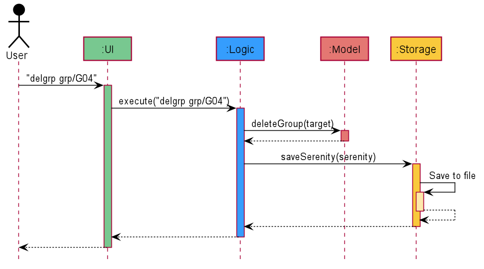</p>

<p align="center"><i>Figure 4.1.2 Interactions between components for the <code>delgrp grp/G04</code> command.</i></p>

The segments below give more details of each component.

### **4.2. Ui Component**

(Contributed by Neo Rui En)

This segment will explain the structure and responsibilities of the Ui component.

#### 4.2.1. Structure

The Class Diagram given in Figure 4.2.1.1 below describes the structure of the Ui-related classes.

<p align="center">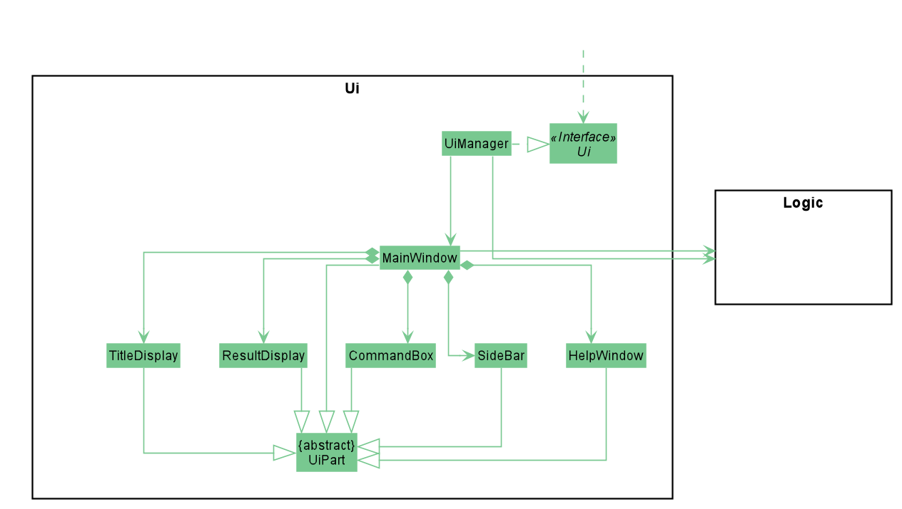</p>

<p align="center"><i>Figure 4.2.1.1 Structure of the <code>Ui</code> component.</i></p>

The `Ui` component contains a `MainWindow` that is made up of smaller parts such as `ResultDisplay` and `CommandBox`
as shown in the Class Diagram above. The `MainWindow`and its parts inherit from the abstract `UiPart` class.
The `Ui` component also contains 1 more window, namely the `HelpWindow`.

The Class Diagram given in Figure 4.2.1.2 below shows how the components in the `Datapanel` interact with each other.

<p align="center">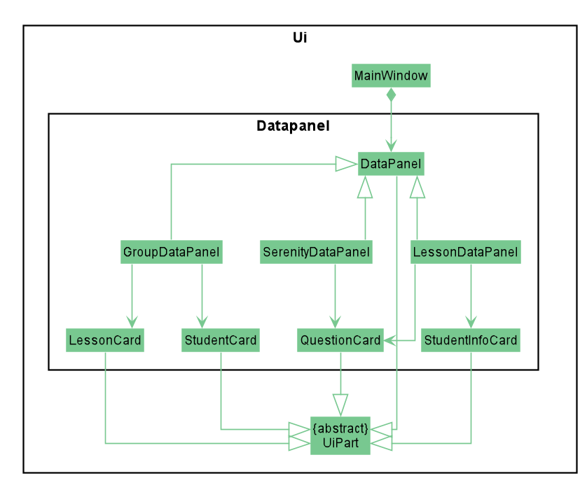</p>

<p align="center"><i>Figure 4.2.1.2 Structure of the <code>ui.datapanel</code> component.</i></p>

The `Ui` contains 3 `DataPanels`, namely `SerenityDataPanel`, `GroupDataPanel` and `LessonDataPanel`.
They facilitate the display of the home page, tutorial group page and tutorial lesson page respectively.
Each of these `DataPanels` consists of one or more cards.

The `Ui` component uses <span><a href="#appendix-e-glossary" style="color:purple"><i>JavaFX</i></a></span> UI framework.
The layout of these UI parts are defined in matching .fxml files that are in the `src/main/resources/view` folder.
For example, the layout of the `MainWindow` is specified in `MainWindow.fxml`

#### 4.2.2. Responsibilities

The `Ui` component,
* Executes user commands using the `Logic` component.
* Listens for changes to `Model` data so that the <span><a href="#appendix-e-glossary" style="color:purple"><i>GUI</i></a></span> can be updated with the modified data.

### 4.3. Logic Component

(Contributed by Neo Rui En)

This segment will explain the structure and responsibilities of the `Logic` component.

#### 4.3.1. Structure

The Class Diagram given in Figure 4.3.1.1 below describes the structure of Logic-related classes.

<p align="center">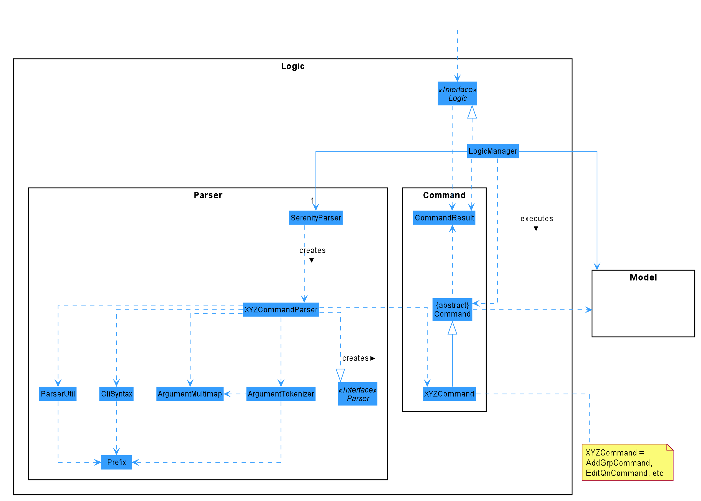</p>

<p align="center"><i>Figure 4.3.1.1 Structure of the <code>Logic</code> component.</i></p>

From the diagram above, you can see that the `Logic` component is split into 2 groups, one for command and another for command parsing.
As **Serenity** follows a *Command* Pattern, a specific `XYZCommand` class will inherit from the abstract `Command` class.
This allows the `LogicManager` to execute these commands without having to know each command type.

#### 4.3.2. Responsibilities

The `Logic` component is in charge of command parsing from the commands given by the user through the `Ui` component. It is also responsible for command execution.

1. `Logic` uses the `SerenityParser` class to parse the user command.
1. This results in a `Command` object which is executed by the `LogicManager`.
1. The command execution can affect the `Model` (e.g. adding an activity).
1. The result of the command execution is encapsulated as a `CommandResult` object which is passed back to the `Ui`.
1. In addition, the `CommandResult` object can also instruct the `Ui` to perform certain actions, such as displaying help to the user.

The steps described above will be the standard command parsing and execution of every command in **Serenity**.
The Sequence Diagram given in Figure 4.3.2.1 below shows the interactions inside the Logic component
when the command `delgrp grp/G04` is executed.
The diagram starts with the `execute("delgrp grp/G04")` API call.

<p align="center">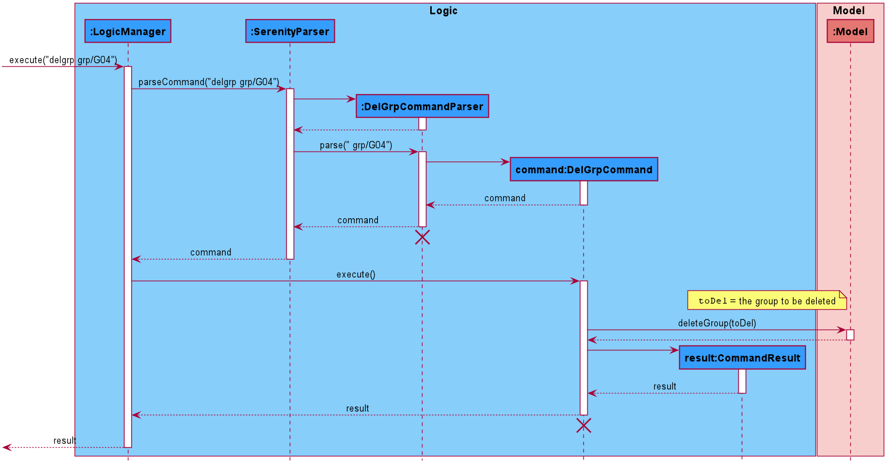</p>

<p align="center"><i>Figure 4.3.2.1 Interactions inside the <code>Logic</code> component for the <code>delgrp grp/G04</code> command.</i></p>

<div markdown="block" class="alert alert-info">

:information_source: **Note:** The lifelines for the `DelGrpCommandParser` and `DelGrpCommand` should end at the destroy marker (X). However, 
due to a limitation of PlantUML, the lifelines reached the end of the diagram.

</div>


### 4.4. Model Component

(Contributed by Ryan Lim)

This segment will explain the structure and responsibilities of the `Model` component.

#### 4.4.1. Structure

The Class Diagram given in Figure 4.4.1.1 below describes the structure of Model-related classes.

<p align="center">
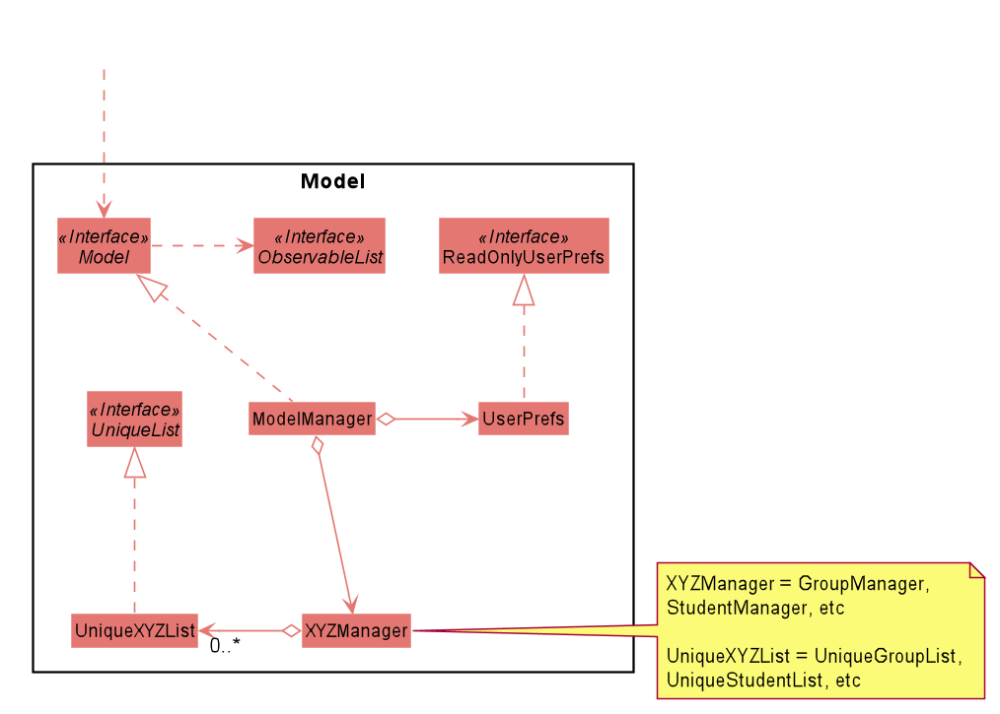</p>

<p align="center"><i>Figure 4.4.1.1 Simplified Class Diagram of <code>model</code> component</i></p>

The `UserPrefs` class represents the user’s preference.

The `ObservableList` interface is exposed by the `Model` component for the `Ui` component to observe and automatically update the <span><a href="#appendix-e-glossary" style="color:purple"><i>GUI</i></a></span> when data in the `Model` component changes.

The `XYZManager` is a generic name given to the following managers, these managers supports each feature of **Serenity** :

* `GroupManager`
* `StudentManager`
* `StudentInfoManager`
* `LessonManager`
* `QuestionManager`

The `UniqueXYZList` is a generic name given to the following unique list, these unique lists supports the storing and manipulation of data in-memory when the App is running:

* `UniqueGroupList`
* `UniqueStudentList`
* `UniqueStudentInfoList`
* `UniqueLessonList`
* `UniqueQuestionList`

Each unique list implements the `UniqueList` interface.

#### 4.4.2. Responsibilities

The `Model` component,

* Represents data of different features of **Serenity**.
* Stores these data in-memory when the app is running.
* Does not depend on the `Ui`, `Logic` and `Storage` components.
* Contains observable data so that the <span><a href="#appendix-e-glossary" style="color:purple"><i>GUI</i></a></span> can automatically update upon data changes.

### 4.5. Storage Component

(contributed by Ryan Lim)

This segment will explain the structure and responsibilities of the `Storage` component.

#### 4.5.1. Structure

The Class Diagram given in Figure 4.5.1.1 below describes the structure of Storage-related classes.

<p align="center">
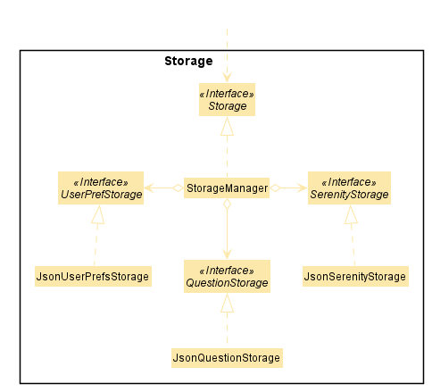</p>

<p align="center"><i>Figure 4.5.1.1 Class diagram of <code>Storage</code> component.</i></p>

The `UserPrefStorage` interface, `SerenityStorage` interface, and the `QuestionStorage` interface defines the API
for reading and saving the Model component’s data from and to the hard disk in JSON format.

The `JsonSerenityStorage` is the implementation of the `SerenityStorage` interface
which supports the storage of data in the application.

#### 4.5.2. Responsibilities

The `Storage` component,

* Can save the `UserPref` object in a JSON format.
* Can parse a JSON file in the correct format to get the `UserPref` object.
* Can save the **Serenity** data in a JSON format.
* Can parse a JSON file in the correct format to get **Serenity** data.

### 4.6. Common Classes

Classes used by multiple other components are in the `team.serenity.commons` package.
The package contains three sub-packages: `core`, `exceptions` and `util`.

#### 4.6.1. Core Class

This package contains classes for user configuration,  <span><a href="#appendix-e-glossary" style="color:purple"><i>GUI</i></a></span> settings, logging manager, guiding messages, index number,
 `Model` object sorters and version number.

#### 4.6.2. Exceptions Class

This package contains classes for exceptions thrown by **Serenity**.

#### 4.6.3. Util Class

This package contains classes for utility operations like file input and output, Excel XLSX file support,
JSON functionalities and image processing.

## **5. Implementation**

This section describes some noteworthy details on how certain features are implemented.

### 5.1. Feature Managers

(contributed by Lim Chun Yong)

**Serenity** provides support for tutors to manage their classes in the following aspects:

* Tutorial groups
* Tutorial lessons
* Students in each tutorial group
* Participation grades and Attendance
* Questions

These individual features are supported by an individual Manager

 * `GroupManager`
 * `LessonManager`
 * `StudentManager`
 * `StudentInfoManager`
 * `QuestionManager`

When describing some common features across all managers, a typical manager shall be referred to as `XYZManager`.

#### 5.1.1. Rationale

These five main `XYZManagers` provide a way for tutors to manage the different aspects of teaching a class,
so as to facilitate teaching a class more effectively.

#### 5.1.2. Current Implementation

This section describes the main implementation common across all `XYZManagers`.

Each `XYZManager` contains one or more `UniqueList`,
a generic interface that enforces uniqueness of the item in the list.
This ensures that every item in the list is unique.
 For example, a `GroupManager` cannot contain more than one Group with the name `G04`.

Each `XYZManager` supports basic <span><a href="#appendix-e-glossary" style="color:purple"><i>CRUD</i></a></span>
operations such as add, delete,
get as well as additional functionality such as sorting.

The XYZManager implements the `ReadOnlyXYZManager` interface.
This interface has the `getXYZList` method which returns an `ObservableList` of items.
The `ObservableList` of items allows the `Ui` model to use the Observer Pattern to update the <span><a href="#appendix-e-glossary" style="color:purple"><i>GUI</i></a></span>
whenever changes are made to the `UniqueList`.

There are two different types of `XYZManager`, one which stores a single `UniqueList`,
such as `GroupManager` and `QuestionManager`, while others store multiple `UniqueList` in a `HashMap`. For instance,
a `StudentManager` stores every `UniqueList` tagged to a `Group` as the key for the `HashMap`.
This enables retrieval of a specific `UniqueList` of `Student` items in a tutorial group.

The Class Diagram given in Figure 5.1.2.1 below shows the structure of `GroupManager`.
`GroupManager` is an example of a `XYZManager` which stores a single `UniqueList`.

<p align="center">
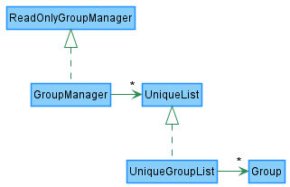</p>

<p align="center"><i>Figure 5.1.2.1 Structure of <code>GroupManager</code></i></p>

### 5.2. Group Manager

(contributed by Lim Chun Yong)

The `GroupManager` is responsible for storing the tutorial groups taught by the Tutor.

#### 5.2.1. Rationale

A tutor has multiple tutorial groups to teach, hence the implementation requires a way to store multiple tutorial groups.

#### 5.2.2. Current Implementation

`GroupManager` contains a `UniqueList` that can store multiple unique `Group` items.

We outline the execution of the `DelGrpCommand` as an example of a command that makes use of `GroupManager`.

The following steps describe the execution of `DelGrpCommand` in detail, assuming that no error is encountered.

1. When the `execute` method of the `DelGrpCommand` is called, the `ModelManager`’s `deleteGroup` method is called.
1. `ModelManager` then proceeds to call the `deleteGroup` method of `GroupManager`.
1. `GroupManager` will then remove the group from its `UniqueList`.
1. If the above steps are all successful, `DelGrpCommand` will then create a `CommandResult` object and return the result.

The Sequence Diagram given in Figure 5.2.2.1 below documents the execution.

<p align="center">
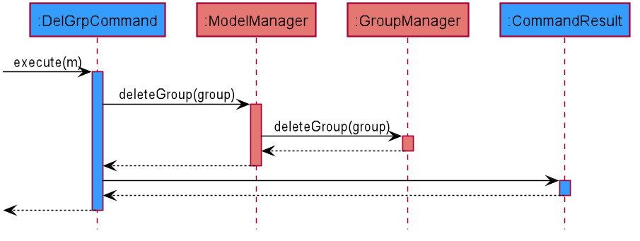</p>

<p align="center"><i>Figure 5.2.2.1 Sequence diagram detailing execution of <code>DelGrpCommand</code></i></p>

#### 5.2.3. Design Consideration

Encapsulating tutorial groups within a `GroupManager` follows the Separation of Concerns principle,
by ensuring that all logic and functionality related to a Tutorial group is encapsulated within `GroupManager`.

### 5.3. Lesson Manager

(Contributed by Ryan Lim)

The `LessonManager` is responsible for storing lessons in a tutorial group

#### 5.3.1. Rationale

Having a `LessonManager` allows for easy retrieval, viewing and updating of the lessons in a particular tutorial group.

#### 5.3.2. Current Implementation

The `LessonManager` contains a `HashMap` whose key is a Group and value is a UniqueList.
In this section, we detail the workflow of adding a lesson to an existing tutorial group through the `addlsn` command.

The Activity Diagram given in Figure 5.3.2.1 below illustrates the execution of the `addlsn` command.

<p align="center">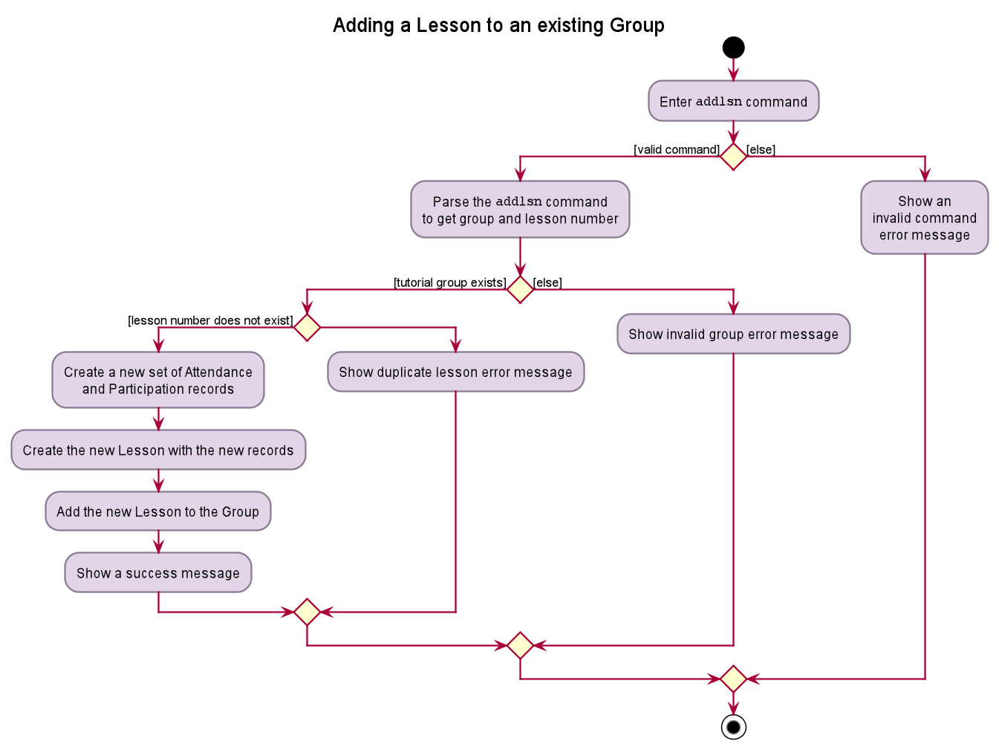addlsn</code> command"></p>
<p align="center"><i>Figure 5.3.2.1. Activity diagram detailing execution of <code>addlsn</code> command.</i></p>

The following steps describe the execution of `addlsn` in detail, assuming that no error is encountered.

1. When the execute method of `AddLsnCommand` is called, a `StudentInfo` object is created for every student in the tutorial group.
2. A new `UniqueList` is created and the `StudentInfo` objects are added to the list.
3. A new `Lesson` object is created with the new UniqueList.
4. The ModelManager’s `updateLessonList` method is called.
5. The ModelManager then calls the method `setListOfLessonsToGroup` of `LessonManager`.

#### 5.3.3. Design Consideration

**Aspect:** Number of `UniqueLists` to hold

|   |**Pros**|**Cons**|
|---|---|---|
| **Option 1**<br>1 `UniqueList`. |  Easy to implement, easier to retrieve all lessons taught by a single tutor.   | More difficult to retrieve lessons tied to a specific group. 
| **Option 2 (current)**<br>More than 1 `UniqueList`. | Easy retrieval of `UniqueList` of Lesson tagged to each `group`.| Greater overhead, more testing and implementation involved. |

**Reason for choosing option 2:**

We picked option 2 for greater flexibility and separation, allowing us to easily retrieve
the list of lessons for a specific tutorial group.

### 5.4. Student Manager

(Contributed by Neo Rui En)

**Serenity** is responsible for storing students in tutorial groups.

#### 5.4.1. Rationale

Tutors have to manage many students.
At the start of the semester, many students may appeal to enter the tutorial group, swap tutorial groups
or even drop out of the module. These changes may give tutors administrative burden as the tutors
may have to spend extra effort to keep track of the student intake changes relating to their tutorial groups.

Importantly, students have to be allocated to unique tutorial groups; no student can be enrolled into
more than one tutorial group for the semester. Hence, it is necessary to have `StudentManager` to
be in charge of doing that.

The `StudentManager` will also be in charge of ensuring that the actions done on a tutorial group level
are correctly applied to the students belonging to the specified tutorial group.

#### 5.4.2. Current Implementation

The `StudentManager` contains a `HashMap` which key is a `GroupName` and value is a `UniqueList<Student>`.
In this section, we will detail the workflow of adding a new student to an existing tutorial group
using the `addstudent` command. The workflow is shown in the Activity Diagram given in Figure 5.4.2.1 below.

<p align="center"></p>
<p align="center"><i>Figure 5.4.2.1. Activity diagram of a <code>addstudent</code> command</i></p>

The following steps describe the workflow of `addstudent` in detail, assuming that no error is encountered.

1. When the execute method of `AddStudentCommand` is called,
the `ModelManager`'s `updateFilteredGroupList` method is called.
1. The `ModelManager` updates its filtered list of `Groups` to contain only the specified `Group`.
1. A new `Student` object is created and added to the `UniqueList<Student>` of the tutorial group.
1. The `ModelManager`'s `updateStudentsInfoList` method is called.
1. The `ModelManager` adds the newly created `Student` object to its `ObservableList<Student>`.
1. The `Ui` component detects this change and updates the <span style="color:purple"><i>GUI</i></span>.
1. The `AddStudentCommand` creates `CommandResult` object and returns the result.

#### 5.4.3. Design Consideration

**Aspect:** Deciding whether the students should be stored inside a `UniqueList<Students>` or
a `HashMap<GroupName, UniqueList<Student>>`.

|   |**Pros**|**Cons**
---|---|---
**Option 1**<br>To store the students inside a `UniqueList<Student>`. | This is easy and straight-forward to implement. | This may involve greater overhead when accessing the list of students in a tutorial group, as the specified group may need to be found from a list of groups before the list of students from the specified group is retrieved.
**Option 2 (Current)**<br>To store the students inside a `HashMap<GroupName, UniqueList<Student>>`. | This allows for more efficient retrieval of the list of students from a tutorial group by just inputting the group's name. | This does not allow the order of addition of students to a group to be maintained.

**Reasons for choosing option 2:**

* As we often need to access the list of students, we cannot afford the greater overhead involved in Option 1. Thus, we decided to opt for the option with greater efficiency.
* As we will sort the list of students of a group after a student is added, we do not require the order of addition of students to be maintained.

### 5.5. StudentInfo Manager

(contributed by Lau Xin Yee)

**Serenity** allows users to keep track of the attendance and participation of students from his/her tutorial lessons.

The `StudentInfoManager` is one of the `Feature Managers` (See [Feature Managers](#51-feature-managers)).
The `StudentInfoManager` helps to collate all the information related to the student, consisting of the student’s
attendance as well as participation score for each lesson.
It contains a `UniqueStudentInfoList` which contains all the `StudentInfo` of every student for each lesson.

#### 5.5.1. Rationale

The `StudentInfoManager` is an important feature to have because a tutor has to keep track of both the attendance
as well as participation of every student. By putting the things to track under `StudentInfo`, it will be much
easier for the teacher to track and is much more organised.

#### 5.5.2. Current Implementation
The `StudentInfoManager` contains a `HashMap` whose key is a `GroupLessonKey` and value is a `UniqueList`.
The following Class Diagram describes the structure of `StudentInfoManager` and its relevant classes.

<p align="center">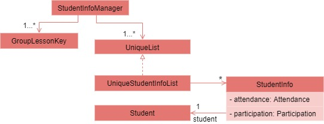</p>
<p align="center"><i>Figure 5.5.2.1. Simplified class diagram of a <code>StudentInfoManager</code> and relevant classes</i></p>

From the diagram given in Figure 5.5.2.1 above, we can see that `StudentInfoManager` can contain multiple `GroupLessonKey` as well as a
`UniqueStudentInfoList` for each `GroupLessonKey`. The table below shows the commands managed by the `StudentInfoManager`.

Commands | Purpose
-------|--------
`markpresent` / `markabsent` | Mark student present / absent during a lesson.
`flagatt` / `unflagatt` | Flag the attendance of a student for special scenarios.
 `addscore` / `subscore` / `editscore`  | Add / subtract / edit the participation score of a student for a lesson.

In this section, we will outline the `markpresent` command handled by the `StudentInfoManager`
which is summarised by the Activity Diagram given in Figure 5.5.2.2 below.
We will be using the index version of the `markpresent` command.

<p align="center">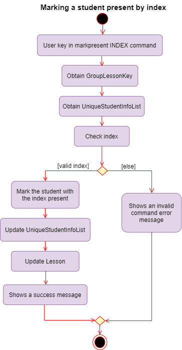</p>
<p align="center"><i>Figure 5.5.2.2 Activity Diagram of a <code>markpresent</code> command by index</i></p>

When the user enters the `markpresent` command followed by an index to mark a student in a lesson present,
the user input command undergoes the parsing to retrieve the index.
The following steps will describe the execution of the `MarkPresentCommand` by index,  assuming that no error is encountered.

1. When the `execute()` method of the `MarkPresentCommand` is called, the `GroupLessonKey` is retrieved to obtain the
`UniqueStudentInfoList` from the `HashMap`.
2. The `StudentInfoManager` then checks whether the index is valid and marks the student present if it is valid.
3. Afterwards, the `StudentInfoManager` will update the `UniqueStudentInfoList`.
4. The `Ui` component will detect this change and update the
<span ><a href="#appendix-e-glossary" style="color:purple"><i>Graphical User Interface (GUI)</i></a></span>.
5. If the above steps are all successful, a successful message will be displayed on the
<span ><a href="#appendix-e-glossary" style="color:purple"><i>Graphical User Interface (GUI)</i></a></span>.

<div class="alert alert-danger" markdown="block">

:warning: **Warning:** If the index is not valid, an error will be thrown to prompt the user to choose another index.

</div>

#### 5.5.3. Design Consideration
**Aspect:** Deciding between retrieving `StudentInfo` through deep nesting methods or using `HashMap` to retrieve `StudentInfo` with `GroupLessonKey`.

|   |**Pros**|**Cons**|
|---|---|---|
| **Option 1**<br>Reach into `Group`, followed by `Lesson` to retrieve `StudentInfo`. | More intuitive. | Nesting of data makes it harder to test.
| **Option 2 (Current)**<br>Store and retrieve `StudentInfo` from a `HashMap` with the combination of `Group` name and `Lesson` name forming the key. | Easier to retrieve data. <br> <br> Less nesting of data allows testing to be done more easily. | Need to put in more thought into coming up with the Manager structures to prevent cyclic dependencies. |

**Reasons for choosing option 2:**

* We originally used Option 1. However, deep nesting of data is a very worrying problem as it makes it hard to test the code and increases the chances of
the code breaking if any intermediate classes are not functioning properly.
* Option 2, despite being more complicated, solves our problem without adding much overhead. Thus, we decided option 2 is better.

### 5.6. Question Manager

(Contributed by Bu Wen Jin)

**Serenity** allows the user to keep track of the questions asked from his/her tutorial lessons for each tutorial group.

The question manager is one of the `Feature Managers` (See [Feature Managers](#51-feature-managers)).
On top of the basic operations provided above it also allows the user to find questions by keywords using the `findqn`
command. The `findqn` command does not restrict users to find via only one keyword. They are able to find via multiple
keywords, similar to a search bar. E.g. `findqn deadline report` will search and list all question entries with
`deadline` and `report` in the `Question`'s description.

#### 5.6.1. Rationale

The `QuestionManager` is an important feature to have because in any tutorial lesson, students will be asking tutors
many questions, verbally or through virtual means such as Whatsapp or Telegram. Thus, we decided to create a question
manager to manage and track all the questions asked during lessons.

#### 5.6.2. Current Implementation

The current implementation of the `QuestionManager` only allows the user to keep track of a list of questions for each
of the lessons for each tutorial group. It does not allow the user to add questions without a tutorial group and lesson.

In this section, we will outline the `findqn` command of the `QuestionManager` which is summarised by the
Activity Diagram given in Figure 5.6.2.1 below.

<p align="center">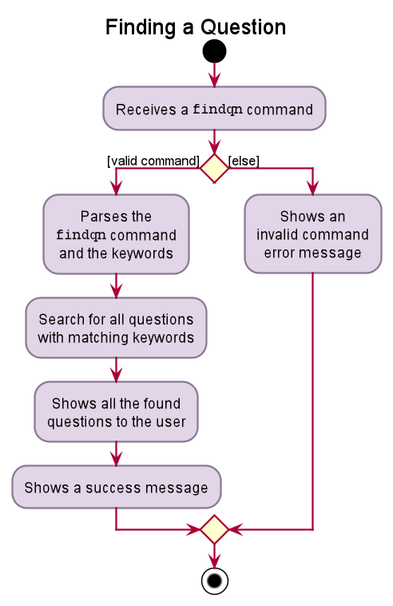</p>

<p align="center"><i>Figure 5.6.2.1. Activity diagram of a <code>findqn</code> command</i></p>

When the user enters the `findqn` command to search for questions, the user input command undergoes the same command
parsing as described in [Design - Logic Component](#43-logic-component). During the parsing, a predicate is created. This predicate
checks if a given `Question`'s description contains the user input keywords. The `FindQnCommand` will then receive
this predicate when it is created.

The following steps will describe the execution of the `FindQnCommand` in detail, assuming that no error is encountered.

1. When the `execute` method of the `FindQnCommand` is called, the `ModelManager`’s `updateFilteredQuestionList` method is called.
2. The `ModelManager` will then update its filtered list of `Question`'s to contain only `Question`'s that fulfil the given predicate.
3. The `Ui` component will detect this change and update the <span style="color:purple"><i>GUI</i></span>.
4. If the above steps are all successful, the `FindQnCommand` will then create a `CommandResult` object and return the result.

The Sequence Diagram given in Figure 5.6.2.2 below summarises the aforementioned steps.

<p align="center">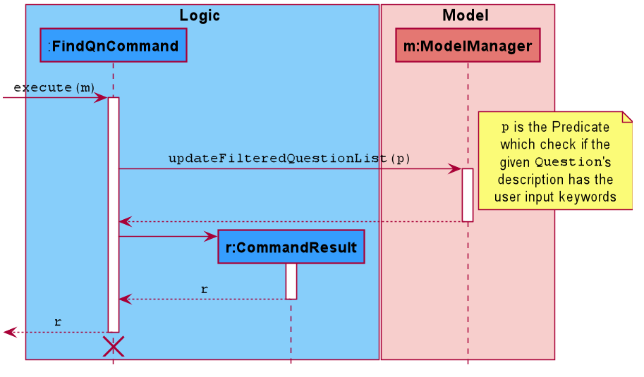</p>

<p align="center"><i>Figure 5.6.2.2. Sequence diagram detailing execution of <code>FindQnCommand</code></i></p>

#### 5.6.3. Design Consideration

**Aspect:** Deciding between storing a question in a global question list and a lesson-specified question list.

|   |**Pros**|**Cons**|
|---|---|---|
| **Option 1 (Current)**<br>To store the questions to a global question list. | Better user experience as the user is able to see the full list of questions from every lesson.<br><br>Reduce data nesting as the list of questions are abstracted out as a separate component. | Complicated to filter out questions for a specific tutorial group and lesson. |
| **Option 2**<br>To store the questions in a list in each lesson. | Straight-forward and easier to implement.|Difficult to sieve through each lesson to collate all the questions from every group to display. |

**Reasons for choosing option 1:**

* The question feature is a key feature in our application. Thus, we decided to opt for the option with better user experience.
* Both options have overheads when trying to view all questions and to view an individual lesson’s questions. However, option 2 is more costly and complicated to implement given the time constraints. Thus, we decided option 1 is better.

## **6. Documentation, Logging, Testing, Configuration, Dev Ops**

* [Documentation guide](Documentation.md)

* [Logging guide](Logging.md)

* [Testing guide](Testing.md)

* [Configuration guide](Configuration.md)

* [DevOps guide](DevOps.md)

## **Appendix A: Product Scope**

**Target user profile:**
* Has a need to manage a significant number of students from various CS2101 classes
* Has a need to keep track of the students' attendance throughout the semester
* Has a need to keep track of the students' participation throughout the semester
* Likes to keep track of the students' unanswered questions
* Likes to handle most administrative work via one platform
* Prefer desktop apps over other types
* Can type fast
* Prefers typing to mouse interactions
* Is reasonably comfortable using CLI apps

**Value proposition:**
* **Serenity** can help assist the management of a CS2101 class faster than a typical mouse /
 <span ><a href="#appendix-e-glossary" style="color:purple"><i>Graphical User Interface (GUI)</i></a></span> driven app through easy reference and editing of class data.
* **Serenity** consolidates administrative information on a
 <span ><a href="#appendix-e-glossary" style="color:purple"><i>Graphical User Interface (GUI)</i></a></span>
 for convenient viewing.
* **Serenity** gives the tutor ability to export data which can be used in other software, e.g. Microsoft Excel.

## **Appendix B: User Stories**

As a... | I want to... | So that I can...
| ------------- | ------------- | ------------- |
Tutor | Set up tutorial groups that I am teaching at the start of every semester. | Perform administrative functions more efficiently.
Tutor | Mark attendance across every lesson. | Grade effectively at the end of the term.
Tutor | Flag the attendance of a student. | Be reminded to check up on this student after lesson.
Tutor | View the attendance sheet for each class. | Identify the students who did not attend a lesson.
Tutor | Export attendance of all my tutorial groups as a XLSX file. | Submit attendance as a softcopy to the school.
Tutor | Use a participation system to keep track of participation. | Grade effectively at the end of the term.
Tutor | Give a participation score to a student. | Grade the student's participation.
Tutor | Generate the average score for each student across each session. | Have an additional set of data to cross reference to.
Tutor | Export participation scores of each class as a XLSX file. | Submit it as a softcopy for marks generation.
Tutor | Add a question to the question list. | Be reminded to answer the question after the lesson ends.
Tutor | Remove a question from the question list. | Prevent the list from becoming too cluttered.
Tutor | View the list of questions for each class. | Identify the questions that I have not answered in class.
Tutor | Import data of my students. | Avoid manually entering the data.
Tutor | Access the list of commands easily on the software without referring to the user guide. | Operate the software easily while teaching in class.
Tutor | Use an app that does not take up too much screen space. | Continue to teach the content effectively.
Tutor | The list of commands to be as short as possible. | Be productive trying to recall more important things for the lesson.

## **Appendix C: Use Cases**
For all use cases below, the System is `Serenity` and the Actor is the `User`, unless specified otherwise.

**Setting Up**

```
UC01: Set up tutorial group

System: Serenity
Actor: User

Guarantees:
    - The tutorial group is added to the tutorial group list upon successful command.
    - Students are added to the student list in the respective tutorial groups upon successful command.

MSS:
    1. User chooses an Excel file of type .xlsx to upload.
    2. User adds the Excel file in the same folder as the JAR file.
    3. Serenity reads the Excel file.
    4. Serenity adds the tutorial groups and students to the respective lists.
Use case ends.
```
**Attendance Taking**

```
UC02: For a tutorial group, mark all students present for a lesson

System: Serenity
Actor: User

Preconditions: Tutorial groups and students have been set up
Guarantees:
    - Each student is marked present for a lesson upon successful command.

MSS:
    1. User requests to mark all students from a specific tutorial group present for a lesson.
    2. User receives a confirmation message.
    3. System shows the updated attendance list for the lesson.
Use case ends.

Extensions:
    1a. Incomplete details are given.
        1a1. System shows an error message.
        Use case resumes at step 1.
```

```
UC03: Mark a student present or absent for a specific lesson

System: Serenity
Actor: User

Preconditions: Tutorial groups and students have been set up
Guarantees:
    - A specific student is marked present or absent for a lesson upon successful command.

MSS:
    1. User requests to mark a student from a specific tutorial group present or absent for a lesson.
    2. User receives a confirmation message.
    3. System shows the updated attendance list for the lesson.
Use case ends.

Extensions:
    1a. Incomplete details are given.
        1a1. System shows an error message.
        Use case resumes at step 1.

```

```
UC04: For a tutorial group, view attendance of each student for every lesson

System: Serenity
Actor: User

Preconditions: Tutorial groups and students have been set up
Guarantees:
    - User can view the attendance list of a lesson 
      for a specific tutorial class upon successful command.

MSS:
    1. User requests to view the attendance list for a lesson of a specific tutorial class.
    2. User receives a confirmation message.
    3. System shows the attendance list for the lesson.
Use case ends.

Extensions:
    1a. Incomplete details are given.
        1a1. System shows an error message.
        Use case resumes at step 1.

```

**Class Participation**

```
UC05: Add class participation marks to a student

System: Serenity
Actor: User

Preconditions: Tutorial groups and students have been set up
Guarantees:
    - For a lesson, class participation marks for a specific student is added upon successful command.

MSS:
    1. User requests to add class participation marks to a student.
    2. User receives a confirmation message.
    3. System shows the updated class participation marks of the student.
Use case ends.

Extensions:
    1a. Incomplete details are given.
        1a1. System shows an error message.
        Use case resumes at step 1.

```

```
UC06: View average class participation score of all students in a tutorial group

System: Serenity
Actor: User

Preconditions: Tutorial groups and students have been set up
Guarantees:
    - User can view the average class participation score of all students 
      in a tutorial group upon successful command.

MSS:
    1. User requests to view the average class participation score of all students in a tutorial group.
    2. User receives a confirmation message.
    3. System shows the average class participation score of all students in the tutorial group
Use case ends.

Extensions:
    1a. Incomplete details are given.
        1a1. System shows an error message.
        Use case resumes at step 1.

```

**Addressing Questions**


```
 
UC07: Add a question to a tutorial group’s question list

System: Serenity
Actor: User

Preconditions: Tutorial groups and students have been set up
Guarantees:
    - Question will be added into a question list upon successful command.

MSS:
    1. User requests to create a new question for a tutorial group.
    2. System shows an updated list of questions.
Use case ends.

Extensions:
    1a. Incomplete details are given.
        1a1. System shows an error message.
        Use case resumes at step 1.

```

```
UC08: View all questions of a tutorial group

System: Serenity
Actor: User

Preconditions: Tutorial groups and students have been set up
Guarantees:
    - User can view the list of questions upon successful command.

MSS:
    1. User requests to view the list of questions for a tutorial group.
    2. System shows the attendance list for the lesson.
Use case ends.

Extensions:
    1a. Incomplete details are given.
        1a1. System shows an error message.
        Use case resumes at step 1.

```


## **Appendix D: Non Functional Requirements**

1. The product should work on any <span><a href="#appendix-e-glossary" style="color:purple"><i>mainstream OS</i></a></span> as long as it has Java 11 or above installed.
1. The product should be able to hold up to 30 students per tutorial group and up to 10 tutorial groups without a noticeable sluggishness in performance for typical usage.
1. The product should be for a single user i.e. (not a multi-user product).
1. The product should not require an online connection.
1. The product should not depend on a remote server.
1. The product should work without requiring an installer.
1. A user with above average typing speed for regular English text (i.e. not code, not system admin commands) should be able to accomplish most of the tasks faster using commands than using the mouse.
1. The data should be stored locally into a human editable text file.

## **Appendix E: Glossary**

**Name** | **Description**
------------ | -------------
**Command Line Interface (CLI)** | This refers to the text-based user interface used for entering commands.
**CRUD** | This represents the four basic functions of storage: create, read, update, and delete.
**Graphical User Interface (GUI)** | This refers to the visual display shown on the screen.
**JavaFX** | This is a software platform for creating and delivering desktop applications, as well as rich Internet applications (RIAs) that can run across a wide variety of devices.
**Key** | In a Hash Table, a key is mapped to a value. This enables quick retrieval of the value associated with a key.
**Mainstream OS** | This consists of Windows, Linux, Unix, macOS.

## **Appendix F: Instructions for Manual Testing**

Given below are instructions to test the app manually.

<div markdown="block" class="alert alert-info">

:information_source: **Note:** These instructions only provide a starting point for testers to work on;
testers are expected to do more **exploratory** testing.

</div>


### F.1. Launch and Shutdown

1. Initial launch
    1. Download the jar file and copy into an empty folder
    1. Double-click the jar file Expected: Shows the <span ><a href="#appendix-e-glossary" style="color:purple"><i>Graphical User Interface (GUI)</i></a></span> with a set of sample contacts. The window size may not be optimum.
1. Saving window preferences
    1. Resize the window to an optimum size. Move the window to a different location. Close the window.
    1. Re-launch the app by double-clicking the jar file.
    1. Expected: The most recent window size and location is retained.

### F.2. Adding Group, Lesson and Student

1. Adding a Group in **Serenity**.
    1. Prerequisites: XLSX file must be in the same folder as `Serenity`
    1. Test case: `addgrp grp grp/<GROUP_NAME> path/<FILE_NAME>.xlsx`
    <br>Expected: Tutorial group created,
    <span><a href="#appendix-e-glossary" style="color:purple"><i>GUI</i></a></span> updates to show the tutorial lessons specified in the XLSX file.
    1. Other incorrect add group commands to try: `addgrp`, `addgrp grp/<GROUP_NAME>`, `addgrp path/<FILE_NAME>.xlsx`
    <br>Expected: Error message shown.

1. Adding Lesson to a Group
    1. Prerequisites: Tutorial group is already set up, lesson name to be added does not already exist in the group.
    1. Test case: `addlsn grp/<GROUP_NAME> lsn/<LESSON_NAME>`
    <br>Expected: Tutorial lesson added,
    <span><a href="#appendix-e-glossary" style="color:purple"><i>GUI</i></a></span> updates to show the student information in the tutorial lesson created.
    1. Other incorrect add group commands to try: `addlsn`, `addlsn grp/<GROUP_NAME>`, `addlsn lsn/<LESSON_NAME>`
    <br>Expected: Error message shown.

1. Adding Student to a Group
    1. Prerequisites: Tutorial group is already set up.
    1. Test case: `addstudent grp/<GROUP_NAME> name/<STUDENT_NAME> matric/<STUDENT_MATRICULATION_NUMBER>`
    <br>Expected: Student added,
    success message shown: `You added <STUDENT_NAME> (<STUDENT_MATRICULATION_NUMBER>) to tutorial group <GROUP_NAME>.`
    1. Other incorrect add group commands to try: `addstudent`, `addstudent grp/<GROUP_NAME>`, `addstudent name/<STUDENT_NAME>`
    <br>Expected: Error message shown.

### F.3. Missing Data Files

1. Missing data files
    1. Test case: In the folder where **Serenity** is stored, delete `serenity.json` in `data` folder
    <br>Expected: Tutorial group G01 created,
    tutorial group contains three students, Aaron Tan, Benjamin Barker and Catherine Teo.

## **Appendix G: Effort**

Creating **Serenity** was fairly difficult and required significant effort from all the team members.
Cumulatively, the project amassed a great **25,000 lines of code** combined.
This was achieved from **the meticulous planning, productive weekly team meetings, consistent communication and updates
from all team members**.

### G.1. Major Enhancements

The development of **Serenity** involves huge enhancements from **Address Book 3**.
The following points highlights the major enhancements that we have incorporated into **Serenity**.

* From just keeping track of different `Person` objects in **Address Book 3** ,
**Serenity** is a major upgrade as it is an all-in-one application that allows the user to keep track of different
`Group`, `Lesson`, `Student` objects. The association class `StudentInfo` was created for each `Student` in every
tutorial `Lesson` to keep track of the student's `Attendance` and `Participation` score.
The `Question` class was also designed to handle the questions asked by students in a particular `Lesson` of a `Group`.
Following the Law of Demeter, the `Group`, `Lesson`, `Student`, `StudentInfo` and `Question` classes were
further refactored into [Feature Managers](#51-feature-managers) to minimize coupling between the classes.

* While the `Ui` of *Address Book 3* contains only 1 `ListView`, **Serenity** has 6 `ListViews` and 2 `TableViews`.
These views were placed in `TabPanes` and they were spread out across 3 pages - the home page, the tutorial group page and
the tutorial lesson page. Furthermore, **Serenity** has additional _TitleDisplay_ and _SideBar_ `Ui` components that
show the title of the page the user is viewing and the shortcut buttons respectively.
These changes allowed the `Ui` of **Serenity** to be significantly more appealing than that of **Address Book 3**'s.

* **Serenity** has Excel XLSX support that allows data to be imported and exported.
Users are able to efficiently add a new tutorial group by importing a XLSX file containing a list of students and
(optionally) tutorial lessons. The resulting tutorial group will automatically contain the list of students and
tutorial lessons. Users are also able to conveniently export attendance and participation score sheets of a specified
tutorial group as XLSX files. The resulting XLSX file will either contain attendance or participation score records of
each student across all tutorial lessons in the tutorial group. These features were designed with the user's needs in
mind after surveying all the CS2101 tutors and interviewing a CS2101 tutor.

### **G.2. Challenges**

Throughout the development of **Serenity**, significant hurdles were faced in development.
We detail some of the challenges faced, and steps we took to solve them.

**Challenge 1: Design stage**

The first challenge we faced involved the planning stage, where we had to have various
different entities (tutorial groups, lessons, students and their records) come together.
Compared to **AddressBook 3**, which had a single `Person` object in the model, we had to
revamp it to accommodate multiple entities such as `Group`, `Lesson`, `Student` and `StudentInfo`, while
ensuring we adhere to principles such as Separation of concerns
and avoiding deep nesting.

**Our solution to the challenge:**

A key part towards solving this is laying down design requirements at the start
of the project, to minimize the risk of refactoring and overhauling at 
the end of our project. Requirements were clearly set up before any development began.
Weekly team meetings were held to allocate tasks and plan for the week ahead.
Within each week, we continued to update each other daily on our individual progress,
to stay aware of the latest changes done in the project.
We placed heavy emphasis on communication and put in a collaborative effort in ensuring
that the project's challenges and tasks are clearly identified.

**Challenge 2: Implementation**

**Serenity** allows users to view the different aspects of their lessons, 
such as viewing attendance records, participation records, lesson details and group details. 
This posed a challenge in implementing an intuitive
<span ><a href="#appendix-e-glossary" style="color:purple"><i>GUI</i></a></span> that also updated automatically
whenever data is created, updated or removed.

Starting from **AddressBook 3**, which had a single Ui panel, we had to overhaul
and expand it to accommodate multiple different panels, each serving a different purpose
such as viewing tutorial groups, to viewing tutorial lessons and viewing attendance records, 
which meant a significant portion of time spent on 
designing the interface to accommodate these different entities.

Another significant functionality **Serenity** includes is the ability to import from and
export data into Excel sheets, which was a feature requested by CS2101 tutors we 
spoke to. A large amount of time and consideration had to be placed in developing
these new features to ensure they worked as expected, being a completely new
function that was not modified from **AddressBook 3**. That, combined together
with the number of commands we implemented, **26** compared to **AddressBook 3**'s
**7**, meant a significant increase in development time spent implementing
these new commands.

**Our solution to the challenge:**

As we dived deeper into development, it became clear that there are a few
categories we needed to work on: Ui, Storage, Model and Logic. We each took on 
individual responsibilities in these different categories, 
helping everyone establish a sense of responsibility
for a certain portion of **Serenity**, empowering them to focus on said features.

### **G.3. Conclusion**

Overall, we managed to create an all-in-one CS2101 tutorial group manager that is equipped with
user-focused features and a neat user interface. Our team put in a huge amount of effort 
in enhancing our features andensuring that the features work as intended. 
Throughout the development process, we consistently helped one another
in identifying and solving implementation and documentation bugs, 
as well as assisted one another in implementing
tricky functionalities. The development process has been a wholly enjoyable one, and each one of us
have turned into a better developer in this journey. 

