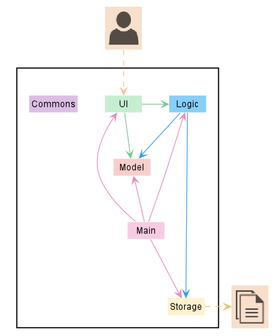
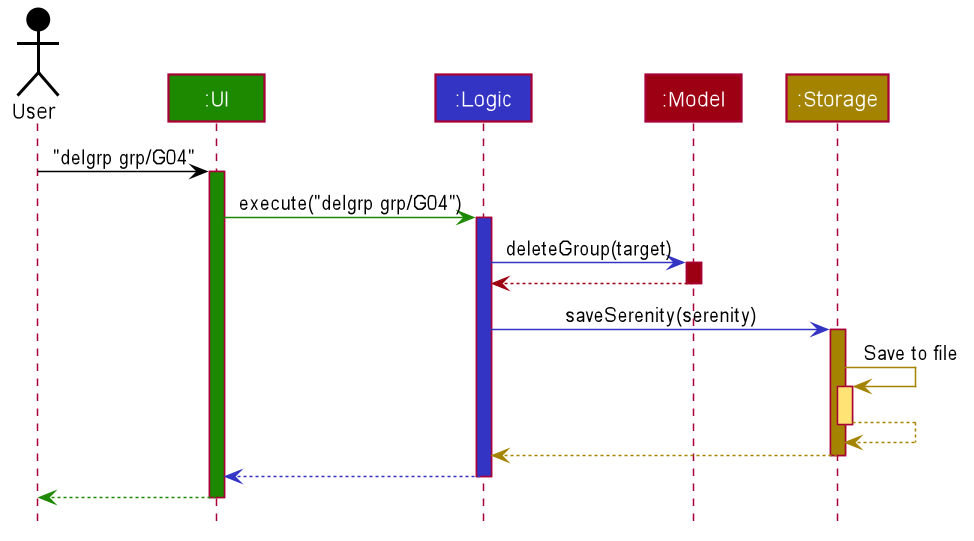
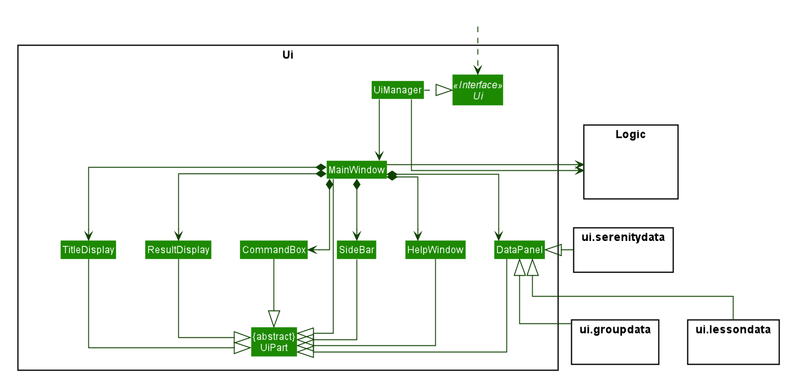

* Table of Contents
{:toc}

--------------------------------------------------------------------------------------------------------------------

## **1. Introduction**


--------------------------------------------------------------------------------------------------------------------

## **2. Setting up, getting started**

Refer to the guide [_Setting up and getting started_](SettingUp.md).

## **3. Design**

### **3.1 Architecture**

(Contributed by Neo Rui En)
The Architecture Diagram given in Figure 1 below explains the high-level design of Serenity.



<p align="center">Figure 3.1.1 Architecture Diagram of Serenity</p>

> :bulb: Tip: The .puml files used to create diagrams in this document can be found in the *diagrams* folder. 

Component | Description
------------ | -------------
`Main` | Has two classes called `Main` and `MainApp`. It is responsible for: <ul><li>At app launch: Initializes the components in the correct sequence, and connects them up with one another.</li><li> At shut down: Shuts down the components and cleanup resources where necessary.</li></ul>
`Commons` | Represents a collection of classes used by multiple different components. |
`Ui`| Displays the Ui of the App to users. Defines its API in the Ui interface and exposes its functionality through the UiManager class.
`Logic` | Executes the command that user inputs. Defines its API in the Logic interface and exposes its functionality through the LogicManager class.
`Model` | Holds the data of the App in-memory. Defines its API in the Model interface and exposes its functionality through the ModelManager class.
`Storage` | Reads data from, and writes data to, the hard disk. Defines its API in the Storage interface and exposes its functionality through the StorageManager class.

**How the architecture components interact with each other**
The Sequence Diagram in Figure 2 below shows how the components interact with each other for the scenario where the user issues the command delete 1.



<p align="center"><i>Figure 3.1.2 Interactions between components for the <code>delgrp grp/G04</code> command.</i></p>

The sections below give more details of each component.

### **3.2 UI Component**

(Contributed by Neo Rui En)
This segment will explain the structure and responsibilities of the Ui component.

#### **3.2.1. Structure**



<p align="center"><i>Figure 3.2.1 Structure of the <code>Ui</code> component.</i></p>

The Ui component contains a `MainWindow` that is made up of smaller parts such as `ResultDisplay` and `CommandBox` as shown in the Class Diagram above. The MainWindow and its parts inherit from the abstract UiPart class.
 
The Ui component uses <span style="color:purple"><i>JavaFX</i></span> UI framework. 
The layout of these UI parts are defined in matching .fxml files that are in the src/main/resources/view folder. 
For example, the layout of the `MainWindow` is specified in `MainWindow.fxml`

#### **3.2.2 Responsibilities**

The `Ui` component,
Executes user commands using the Logic component.
Listens for changes to Model data so that the <span style="color:purple"><i>GUI</i></span> can be updated with the modified data.


### **3.3 Logic component**

(Contributed by Neo Rui En)
This segment will explain the structure and responsibilities of the `Logic`component.

#### **3.3.1 Structure**


<p align="center"><i>Figure 3.3.1 Structure of <code>Logic</code> component.</i></p>

From the diagram above, you can see that the `Logic` component is split into 2 groups, one for command and another for command parsing. 
As Serenity follows a *Command* Pattern, a specific `XYZCommand` class will inherit from the abstract `Command` class. 
This allows the `LogicManager` to execute these commands without having to know each command type.

#### **3.3.2 Responsibilities**

The `Logic `component is in charge of command parsing from the commands given by the user through the `Ui` component. It is also responsible for command execution.

1. `Logic` uses the `SerenityParser` class to parse the user command.
1. This results in a `Command` object which is executed by the `LogicManager`.
1. The command execution can affect the `Model` (e.g. adding an activity).
1. The result of the command execution is encapsulated as a `CommandResult` object which is passed back to the `Ui`.
1. In addition, the `CommandResult` object can also instruct the `Ui` to perform certain actions, such as displaying help to the user.

The steps described above will be the standard command parsing and execution of every command in **Serenity**. 
To illustrate these steps, the Sequence Diagram for interactions within the Logic component when the command delgrp grp/G04 is shown below. 
The diagram starts with the `execute("delgrp grp/G04")` API call.

> :memo: The lifelines for the `DelGrpCommandParser` and `DelGrpCommand` should end at the destroy marker (X). However, due to a limitation of PlantUML, the lifelines reached the end of the diagram.

### **3.4 Model Component**

(Contributed by Ryan Lim)
This segment will explain the structure and responsibilities of the Model component.

#### **3.4.1 Structure**


<p align="center"><i>Figure 3.4.1.1 Simplified Class Diagram of <code>model</code> component</i></p>

The `UserPrefs` class represents the user’s preference.

The `ObservableList` interface is exposed by the `Model` component for the `Ui` component to observe and automatically update the <span style="color:purple"><i>GUI</i></span> when data in the `Model` component changes.

The `XYZManager` is a generic name given to the following managers, these managers supports each feature of Serenity :

* `GroupManager`
* `StudentManager`
* `StudentInfoManager`
* `LessonManager`
* `QuestionManager`

The `UniqueXYZList` is a generic name given to the following unique list, these unique lists supports the storing and manipulation of data in-memory when the App is running: 

* `UniqueGroupList`
* `UniqueStudentList`
* `UniqueStudentInfoList`
* `UniqueLessonList`
* `UniqueQuestionList`

Each unique list implements the `UniqueList` interface.

#### **3.4.2 Responsibilities**

The Model component,

* Represents data of different features of Serenity..
* Stores these data in-memory when the App is running.
* Does not depend on the Ui, Logic and Storage components.
* Contains observable data so that the GUI can automatically update upon data changes.


### **3.5 Storage Component**

(contributed by Ryan Lim)
This segment will explain the structure and responsibilities of the Storage component.

#### **3.5.1 Structure**


<p align="center"><i>Figure 3.5.1 Class diagram of <code>Storage</code> component.</i></p>

The `UserPrefStorage` interface and `SerenityStorage` interface defines the API
for reading and saving the Model component’s data from and to the hard disk in JSON format.

The `JsonSerenityStorage` is the implementation of the `SerenityStorage` interface 
which supports the storage of data in the application.

#### **3.5.2 Responsibilities**

The Storage component,

* Can save the UserPref object in a JSON format.
* Can parse a json file in the correct format to get the UserPref object.
* Can save the Serenity data in a JSON format.
* Can parse a json file in the correct format to get Serenity data.

### **3.6 Common Classes**

Classes used by multiple other components are in the `team.serenity.commons package` package.

## **4. Implementation** 

### **4.1 Feature Managers**

### **4.2 Group Manager**

### **4.3 Lesson Manager**

### **4.4 Student Manager**

### **4.5 StudentInfo Manager**

### **4.6 Question Manager**

## **Appendix A: Product Scope**

**Target user profile:**
* Has a need to manage a significant number of students from various CS2101 classes
* Has a need to keep track of the students' attendance throughout the semester
* Has a need to keep track of the students' participation throughout the semester
* Likes to keep track of the students' unanswered questions
* Likes to handle most administrative work via one platform
* Prefer desktop apps over other types
* Can type fast
* Prefers typing to mouse interactions
* Is reasonably comfortable using CLI apps

**Value proposition:** 
* Serenity can help assist the management of a CS2101 class faster than a typical mouse / GUI driven app through easy reference and editing of class data.
* Serenity consolidates administrative information on a GUI for convenient viewing.
* Serenity gives the tutor ability to export data which can be used in other software, e.g. Microsoft Excel.

## **Appendix B: User Stories**

As a... | I want to... | So that I can...
| ------------- | ------------- | ------------- |
Tutor | Set up tutorial groups that I am teaching at the start of every semester | Perform administrative functions more efficiently
Tutor | Mark attendance across every lesson | Grade effectively at the end of the term
Tutor | Flag the attendance of a student | Be reminded to check up on this student after lesson
Tutor | View the attendance sheet for each class | Identify the students who did not attend a lesson
Tutor | Export attendance of all my tutorial groups as a XLSX file | Submit attendance as a softcopy to the school
Tutor | Use a participation system to keep track of participation | Grade effectively at the end of the term
Tutor | Give a participation score to a student | Grade the student's participation
Tutor | Generate the average score for each student across each session | Have an additional set of data to cross reference to
Tutor | Export participation scores of each class as a XLSX file | Submit it as a softcopy for marks generation
Tutor | Add a question to the question list | Be reminded to answer the question after the lesson ends
Tutor | Remove a question from the question list | Prevent the list from becoming too cluttered
Tutor | View the list of questions for each class | Identify the questions that I have not answered in class
Tutor | Mark the question that I have addressed as answered | Avoid re-addressing the same question in class
Tutor | Import data of my students | Avoid manually entering the data
Tutor | Access the list of commands easily on the software without referring to the user guide | Operate the software easily while teaching in class
Tutor | Use an app that does not take up too much screen space | Continue to teach the content effectively
Tutor | The list of commands to be as short as possible | Be productive trying to recall more important things for the lesson


## **Appendix C: Use Cases**
For all use cases below, the System is `Serenity` and the Actor is the `User`, unless specified otherwise.

```
UC01: Set up tutorial group

System: Serenity
Actor: User

Guarantees:
    - The tutorial group is added to the tutorial group list upon successful command.
    - Students are added to the student list in the respective tutorial groups upon successful command.

MSS:
    1. User chooses a csv file to upload.
    2. User adds the csv file in the same folder as the JAR file.
    3. Serenity reads the csv file.
    4. Serenity adds the tutorial groups and students to the respective lists.
Use case ends.
```


## **Appendix D: Non Functional Requirements**

1. Should work on any <span style="color:purple"><i>mainstream OS</i></span> as long as it has Java 11 or above installed.
2. Should be able to hold up to 30 students per tutorial group and up 10 tutorial groups without a noticeable sluggishness in performance for typical usage.
3. A user with above average typing speed for regular English text (i.e. not code, not system admin commands) should be able to accomplish most of the tasks faster using commands than using the mouse.


## **Appendix E: Glossary**

## **Appendix F: Instructions for Manual Testing**

Given below are instructions to test the app manually.
> :memo: Note: These instructions only provide a starting point for testers to work on; 
>testers are expected to do more **exploratory** testing.

**Launch and Shutdown**
 1. Initial launch
    1. Download the jar file and copy into an empty folder
    1. Double-click the jar file Expected: Shows the GUI with a set of sample contacts. The window size may not be optimum.
 1. Saving window preferences
    1. Resize the window to an optimum size. Move the window to a different location. Close the window.
    1. Re-launch the app by double-clicking the jar file.
    1. Expected: The most recent window size and location is retained.

 
**Adding/Setting**

Add a new tutorial group in Serenity.
 1. Prerequisites: XLSX file must be in the same folder as `Serenity`
 1. Test case: `addgrp grp grp/<NAME OF TUTORIAL GROUP> path/<NAME OF FILE>.xlsx`
    1. Expected: Tutorial group created, <span style="color:purple"><i>GUI</i></span> updates to show the tutorial lessons specified in the XLSX file.
 1. Other incorrect add group commands to try: `addgrp`, `addgrp grp/<NAME OF TUTORIAL GROUP>`, `addgrp path/<NAME OF FILE>.csv`
    1. Expected: Error message shown.
 
Adding Lesson to a Group
1. Prerequisites: Tutorial group is already set up, lesson name to be added does not already exist in the group.
1. Test case: `addlsn grp/<NAME OF TUTORIAL GROUP> lsn/<LESSON NAME TO ADD>`
    1. Expected: Tutorial lesson added, <span style="color:purple"><i>GUI</i></span> updates to show the new tutorial lesson created.
 1. Other incorrect add group commands to try: `addlsn`, `addlsn grp/<NAME OF TUTORIAL GROUP>`, `addlsn lsn/<LESSON NAME TO ADD>`
    1. Expected: Error message shown.
 
Adding Student to a Group
1. Prerequisites: Tutorial group is already set up.
1. Test case: `addstudent grp/<NAME OF TUTORIAL GROUP> name/<NAME OF STUDENT TO ADD> matric/<MATRICULATION NUMBER OF STUDENT>`
    1. Expected: Success message shown: `You added <Student name> to <Tutorial Group>.`
 1. Other incorrect add group commands to try: `addstudent`, `addstudent grp/<NAME OF TUTORIAL GROUP>` `addstudent name/<NAME OF STUDENT>`
    1. Expected: Error message shown.
 	

**Data**

Missing data files
1. Test case: In the folder where Serenity is stored, delete `serenity.json` in `data` folder 
    1. Expected: New tutorial group G01 created with two students, Aaron Tan and John Doe.
    
**Editing**


