* Table of Contents
{:toc}

--------------------------------------------------------------------------------------------------------------------
## **1. Introduction**

Welcome to the User Guide of **Serenity**!

Are you a tutor teaching CS2101 in NUS? Do you struggle to keep track of students' attendance and class participation
on many different excel sheets for different lessons? Do you also tend to forget to address questions students asked
during lessons? Fret not, our application, **Serenity**, will help keep you sane when managing tutorial groups.

**Serenity** is a desktop application that helps CS2101 tutors manage their lessons. This application is optimized
for use through a <i>Command Line Interface (CLI)</i>, meaning that you operate the application by typing commands into a
command box. This application also has a <i>Graphical User Interface (GUI)</i>, 
where you can interact with the application through graphical icons such as buttons.

This user guide serves to provide you with an in-depth documentation on how to set up and use our application.
With that said, let's get [started](#2-quick-start)!

--------------------------------------------------------------------------------------------------------------------

## **2. Quick start**

To get started with using **Serenity**, you can follow these steps:

1. Ensure you have Java `11` or above installed in your Computer.

2. Download the latest `Serenity.jar` from [here](https://github.com/AY2021S1-CS2103T-W12-4/tp/releases).

3. Copy the file to the folder you want to use as the home folder for your **Serenity** application.

4. Double-click the file to start the app. The _GUI_ similar to the image below should appear in a few seconds.

   

   
   
<i>Figure 2.1 Welcome screen.</i>

5. Type the command in the _Command Box_ and press `Enter` to execute it. 

6. Refer to the [Features](#4-features) below for details of each command.

--------------------------------------------------------------------------------------------------------------------
## **3. About**

### 3.1. Structure of this document

This User Guide have been structured such that you can easily find what you need.

In [section 3.2](#32-reading-this-document), you can find useful tips on reading this document.

In [section 4](#4-features), you can find details of the three main features of **Serenity**:

* Attendance taking

* Participation marking

* Question addressing

### 3.2. Reading this document 

In this subsection, you can find the explanation of the technical terms, symbols and syntax that are used in this
User Guide.

#### 3.2.1. Terminology related to the _GUI_

The following figure shows the _GUI_ of **Serenity**.
It is annotated with the name of the _GUI_ components.

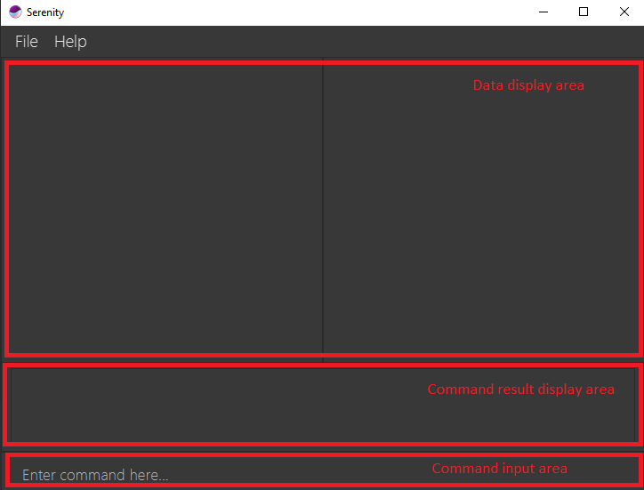

<i>Figure 3.2.1.1 layout of GUI.</i>

#### 3.2.2. Layout of the _GUI_

**Serenity** is divided into four main tabs:

* Flagged attendance tab
* Questions tab
* Group tab
* Lesson tab

##### **Flagged attendance tab** 

This is the main tab of the application, and is the default page when the app is started. It contains 
the names of students whose attendance have been flagged using the `flagatt` command. Flagging a student's
attendance serves as a reminder on the first page of the app for you to check on the student and perform
any follow-up actions, if necessary. 

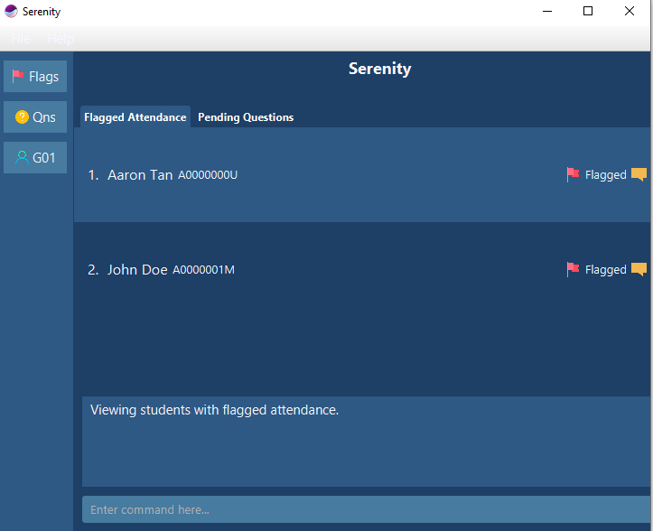

<i>Figure 3.2.2.1 User interface showing the layout of the flagged attendance tab</i>

> :bulb: Tip: Class has started! `Aaron Tan` is not in the zoom class yet. Flag his attendance and 
>proceed with teaching. With the flag attendance tab, you will be reminded to check again after class.

##### **Questions tab**

This tab shows the questions asked across all your tutorial groups, providing a convenient place for you
to keep track of all the questions asked by students across your tutorial groups and lessons.

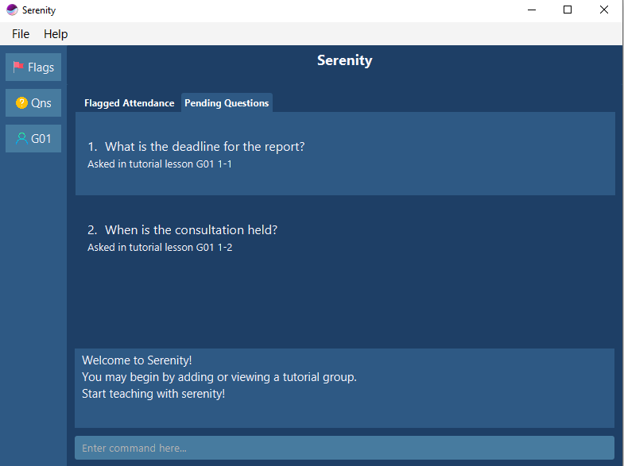

<i>Figure 3.2.2.2 User interface showing the layout of the questions tab</i>

##### **Group tab**

This tab shows the information related to a tutorial group that you are teaching. 
There are four sub-tabs at the top which allows you to view the number of lessons scheduled
for this group, the list of students in the group, 
their attendance records and participation grades respectively. Toggle between them with the 
horizontal row of tabs at the top.

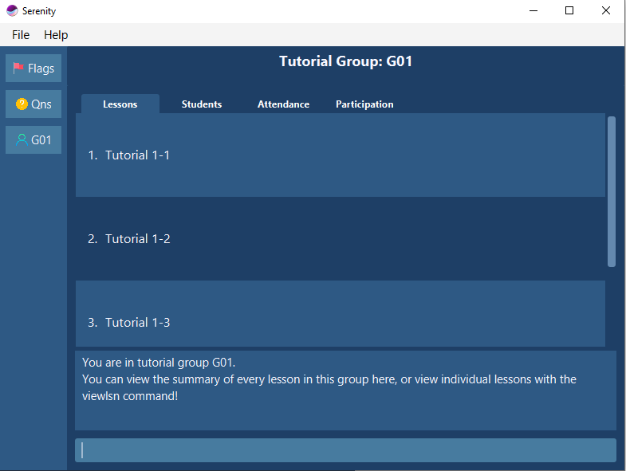

<i>Figure 3.2.2.3 User interface showing the layout of the group tab</i>

##### **Lesson tab**

This tab shows the records for a specific lesson. 

> :memo: This tab is accessible through the `viewlsn` command

In this tab, you are able to:
* Assign and change the [attendance](#42-attendance-taking) and [participation](#43-participation-marking) grades
* Flag a student's attendance
* Add a [question](#44-question-addressing) that is asked during this lesson
* View the attendance and participation grades for this lesson
* View the questions asked during this tutorial lesson

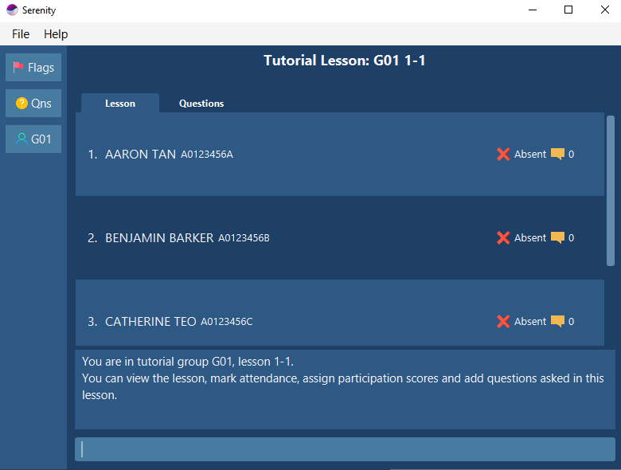

<i>Figure 3.2.2.4 User interface showing the layout of the lesson tab</i>

#### 3.2.3. General symbols and syntax

The table below explains the general symbols and syntax used throughout the document.

Symbol/syntax | Meaning
--------|------------------
`command` | This indicates a technical term, which you can find out more in [Command syntax and usage](#323-command-syntax-and-usage).
_GUI_ | This indicates a graphical component, such as a button, layout format and text input box.
:memo: | This indicates a note.
:bulb: | This indicates a tip.
:warning: | This indicates a warning.

#### 3.2.4. Command syntax and usage

The table below explains some important technical terms.

Technical term | Meaning
--------|------------------
Command | The instruction that the user types into the command box for **Serenity** to perform a specific task.
Command word | The first word of the command that tells **Serenity** which task should be performed.
Parameter | The word or phrase following the command word that provides further details of the task (if necessary).
Prefix | The letter that is placed at the start of each parameter to distinguish one parameter from another.
XLSX | File format for all excel files.

#### 3.2.5. Command format

You can use commands to tell **Serenity** to perform a specific task.

**Format**:

`COMMAND_WORD prefix/PARAMETER`

> :memo: **Notes regarding the command format:**
>* Words in upper case are the parameters to be supplied by you. e.g. in `viewgrp grp/GROUP_NAME`, `GROUP_NAME` is a parameter which can be used as `viewgrp grp/G04`
>* Parameters have to be in the specified order. e.g. if the command specifies `grp/GROUP_NAME lsn/LESSON_NAME`, `lsn/LESSON_NAME grp/GROUP_NAME` is not acceptable.

**Example:**

If you need to add a new tutorial lesson, you can type the following command.

`addlsn grp/GROUP_NAME lsn/LESSON_NAME`

Analysis:

* Command: Add a tutorial lesson

* Command Word: `addlsn`

* Parameter: `GROUP_NAME`, `LESSON_NAME`

* Prefix: `grp/`, `lsn/`

--------------------------------------------------------------------------------------------------------------------

## **4. Features**

This section contains all the information you need to know about the features of **Serenity**.
To use each feature or sub-feature, you will need to enter the command into the _Command Box_.
Below is an overview of the features available in **Serenity** :

1. [Setting up](#41-setting-up) feature provides you the tools to set up your tutorial groups and lessons.
2. [Attendance taking](#42-attendance-taking) feature provides you the tools to mark attendance for your lessons.
3. [Participation marking](#43-participation-marking) feature provides you the tools to grade student participation. 
4. [Question addressing](#44-question-addressing) feature provides you the tools to keep track of questions asked by students.

### 4.1. Setting Up

It is the start of the semester! Brand-new classes, brand-new students and a whole new experience.
Follow the instructions below to set up your new classes, and watch **Serenity** do the magic for you.

#### 4.1.1. Add a new tutorial group from XLSX file: `addgrp`

You can use this command to add a new tutorial group automatically from XLSX data.

> :memo: **Notes regarding the `addgrp` command:**
> * A sample XLSX file can be found [here](https://github.com/AY2021S1-CS2103T-W12-4/tp/blob/master/CS2101_G04.xlsx)
> * The XLSX file should store a list of students.
> * The format of the XLSX file should be the same as the XLSX file that you may download from LUMINUS.
> * To obtain the PATH_TO_XLSX, either: 
>    ◦ Get the location of the XLSX file in your computer. 
>      e.g. `addgrp grp/G04 path/C:\Users\serene\CS2101_G04.xlsx` 
>    ◦ Copy and paste the XLSX file into the same folder as your **Serenity** application, then type the name of the XLSX file. 
>      e.g. `addgrp grp/G04 path/CS2101_G04.xlsx`

**Format:**

`addgrp grp/GROUP_NAME path/PATH_TO_XLSX`

**Example:**

You are adding a new tutorial group named `G04` to prepare for a new semester.
The XLSX data of the tutorial group is stored at `C:\Users\serene\CS2101_G04.xlsx`.

Adding a new tutorial group:

1. Type `addgrp grp/G04 path/C:\Users\serene\CS2101_G04.xlsx` into the _Command Box_.
2. Press `Enter` to execute.

Outcome:

1. The _Result Display_ will show a success message.
2. **Serenity** will switch to tutorial group `G04` page.
3. You can now see the list of students and a default list of tutorial lessons for tutorial group `G04`.

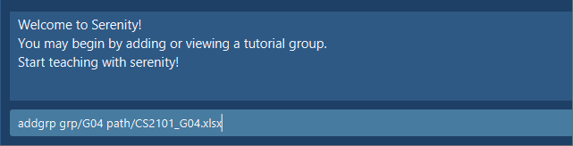

<i>Figure 4.1.1.1 Command for <code>addgrp</code> command.</i>

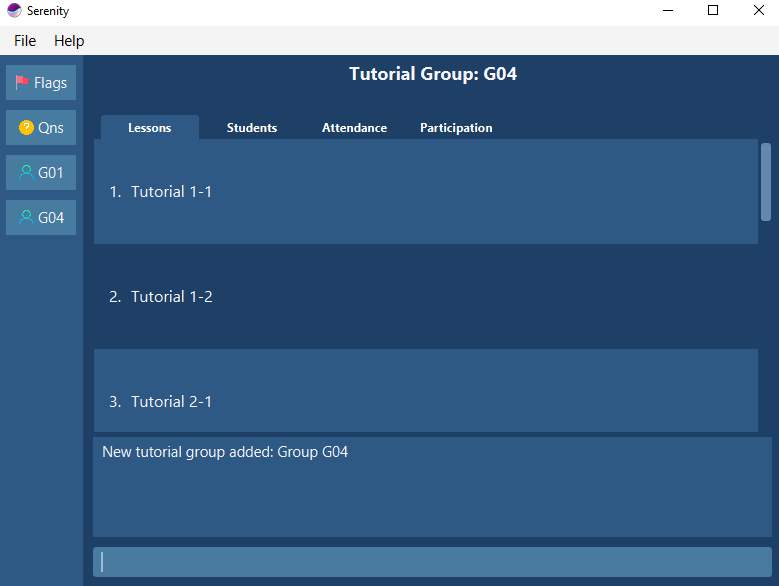

<i>Figure 4.1.1.2 Screen displayed when the command is successfully executed.</i>

####  4.1.2. Delete an existing tutorial group: `delgrp`

You can use this command to delete an existing tutorial group.

**Format:**

`delgrp grp/GROUP_NAME`

**Example:**

You accidentally added the wrong tutorial group `G04` and you decided to remove the tutorial group.

Deleting an existing tutorial group:

1. Type `delgrp grp/G04` into the _Command Box_.
2. Press `Enter` to execute.

Outcome:

1. The _Result Display_ will show a success message.
2. **Serenity** will exit tutorial group `G04` page.
3. You can now see that tutorial group `G04` no longer exists.

#### 4.1.3. Add a new tutorial lesson: `addlsn`

You can use this command to add a new tutorial lesson for a specified tutorial group.

**Format:**

`addlsn grp/GROUP_NAME lsn/LESSON_NAME`

**Example:**

You want to create a new tutorial lesson called `4-2` (week 4, lesson 2) for tutorial group `G04`.

Adding a tutorial lesson to a tutorial group:

1. Type `addlsn grp/G04 lsn/4-2` into the _Command Box_.
2. Press `Enter` to execute.

Outcome:

1. The _Result Display_ will show a success message.
2. **Serenity** will display tutorial lesson `4-2` page.
3. You can now see that tutorial lesson `4-2` has been added to tutorial group `G04`.

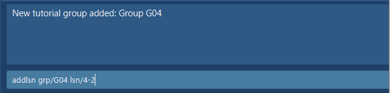

<i>Figure 4.1.3.1 Command for <code>addlsn</code> command.</i>

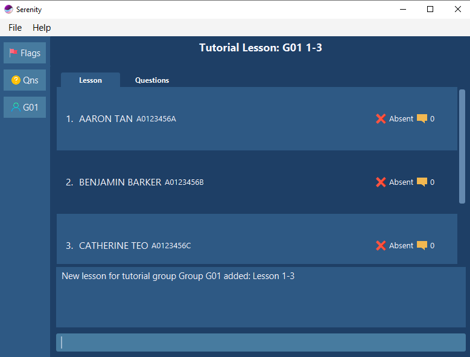

<i>Figure 4.1.3.2 Screen displayed when the command is successfully executed.</i>

#### 4.1.4. Delete an existing tutorial lesson: `dellsn`

You can use this command to delete an existing lesson from a specified tutorial group.

**Format:**

`dellsn grp/GROUP_NAME lsn/LESSON_NAME`

**Example:**

You accidentally added the wrong tutorial lesson `1-3` for tutorial group `G04` and you decided to remove it.

Deleting an existing lesson from a tutorial group:

1. Type `dellsn grp/G04 lsn/1-3` into the _Command Box_.
2. Press `Enter` to execute.

Outcome:

1. The _Result Display_ will show a success message. 
2. **Serenity** will exit tutorial lesson `1-3` page and enter tutorial group `G04` page.
3. You can now see that tutorial lesson `1-3` no longer exists.

#### 4.1.5. Add a new student: `addstudent`

You can use this command to add a new student to a tutorial group.

**Format:**

`addstudent grp/GROUP_NAME name/NAME matric/STUDENT_NUMBER`

**Example:**

A new student named `Aaron Tan` with student number `A0123456U` entered your tutorial group,
and you want to add him to tutorial group `G04`.

Adding a new student to a tutorial group:

1. Type `addstudent grp/G04 name/AARON TAN matric/A0123456U` into the _Command Box_.
2. Press `Enter` to execute.

Outcome:

1. The _Result Display_ will show a success message.
2. `Aaron Tan` will be added to the list of students in tutorial group `G04`.

#### 4.1.6. Delete an existing student: `delstudent`

You can use this command to delete an existing student from a tutorial group.

**Format:**
 `delstudent grp/GROUP_NAME name/NAME matric/STUDENT_NUMBER`
 `delstudent INDEX grp/GROUP_NAME`

**Example:**

A student named `Aaron Tan` with student number `A0123456U` dropped the CS2101 module,
and you need to remove him from the tutorial group `G04`. `Aaron Tan` is the first person on the student list
so his `index` number is 1.

<ins>Method 1</ins>  
Deleting an existing student from a tutorial group by `name` and `student number`:

1. Type `delstudent grp/G04 name/AARON TAN matric/A0123456U` into the _Command Box_.
2. Press `Enter` to execute.

<ins>Method 2</ins>  
Deleting an existing student from a tutorial group by `index` number:

1. Type `delstudent 1 grp/G04` into the _Command Box_.
2. Press `Enter` to execute.

Outcome:

1. The _Result Display_ will show a success message.
2. `Aaron Tan` will no longer be in the list of students in tutorial group `G04`.

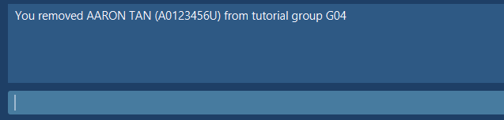

<i>Figure 4.1.6.1 Command for <code>delstudent</code> command</i>

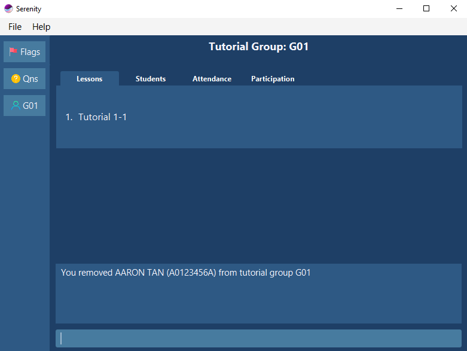

<i>Figure 4.1.6.2 Screen displayed when the command is successfully executed.</i>

### 4.2. Attendance taking

Need to mark attendance of your students at the start of each lesson quickly?
This feature allows you to mark attendance of students easily.

#### 4.2.1. Mark all students as present: `markpresent all`

You can use this command to mark all students in a tutorial group as present for a tutorial lesson.

> :bulb: **Tip for the `markpresent all` command:**
> You can conveniently mark all students as present at once in the beginning of the tutorial lesson,
> then mark some students as absent afterwards. You can then start your tutorial lesson without much hassle.

**Format:** 

`markpresent all`

**Example:**

All students in group `G04` are present for your tutorial lesson `1-2` of tutorial group `G04`. 

Marking all students in a tutorial group as present for a tutorial lesson:

To mark all of them present at once:
1. Navigate to view group `G04` lesson `1-2` via [`viewlsn`](#452-view-a-tutorial-lesson-viewlsn) command.
2. Type `markpresent all` into the *Command Box*.
3. Press `Enter` to execute.

Outcome:

1. The _Result Display_ will show a success message.
2. You can now see that all the students' attendance have been updated on the _Student Information Panel_.

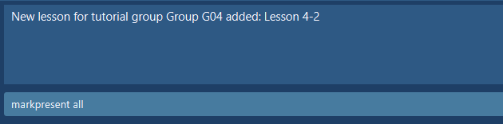

<i>Figure 4.2.1.1 Command for <code>markpresent all</code> command.</i>

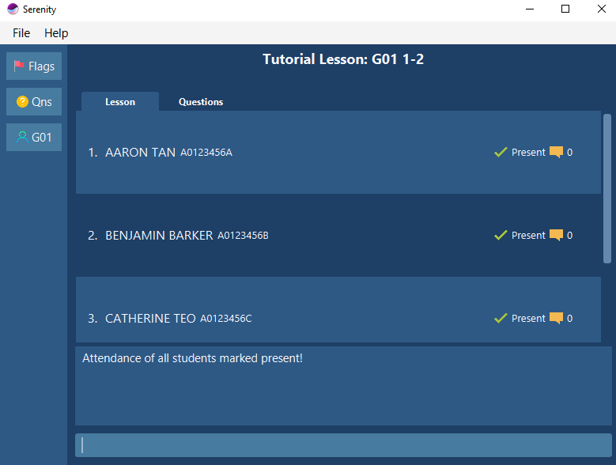

<i>Figure 4.2.1.2 Screen displayed when the command is successfully executed.</i>

#### 4.2.2. Mark a student as present: `markpresent`

You can use this command to mark a specific student as present for a tutorial lesson.

**Format:**
 `markpresent name/NAME matric/STUDENT_NUMBER`
 `markpresent INDEX`

**Example:**

A student named `Aaron Tan` with student number `A0123456U` is present for your tutorial lesson 
`1-2` of tutorial group `G04`. `Aaron Tan` is the first person on the student list so his `index` number is 1.

<ins>Method 1</ins>  
Marking a student as present for a tutorial lesson by `name` and `student number`:

To mark him present:
1. Navigate to view group G04 lesson 1-2 via [`viewlsn`](#452-view-a-tutorial-lesson-viewlsn) command.
2. Type `markpresent name/AARON TAN matric/A0123456U` into the *Command Box*.
3. Press `Enter` to execute.

<ins>Method 2</ins>  
Marking a student as present for a tutorial lesson by `index` number:

To mark him present:
1. Navigate to view group G04 lesson 1-2 via  [`viewlsn`](#452-view-a-tutorial-lesson-viewlsn) command.
2. Type `markpresent 1` into the *Command Box*.
3. Press `Enter` to execute.

Outcome:

1. The _Result Display_ will show a success message.
2. You can now see that his attendance has been updated on the _Student Information Panel_.

#### 4.2.2. Mark a student as absent: `markabsent`

You can use this command to mark a specific student as absent for a tutorial lesson.

**Format:**
 `markabsent name/NAME matric/STUDENT_NUMBER`
 `markabsent INDEX`

**Example:**

A student named `Aaron Tan` with student number `A0123456U` is absent for your tutorial lesson `1-2` of tutorial group `G04`.
`Aaron Tan` is the first person on the student list so his `index` number is 1. 

<ins>Method 1</ins>  
Marking a student as absent for a tutorial lesson by `name` and `student number`:

1. Navigate to view group G04 lesson 1-2 via  [`viewlsn`](#452-view-a-tutorial-lesson-viewlsn) command.
2. Type `markabsent name/AARON TAN matric/A0123456U` into the *Command Box*.
3. Press `Enter` to execute.

<ins>Method 2</ins>  
Marking a student as absent for a tutorial lesson by `index` number:

1. Navigate to view group G04 lesson 1-2 via  [`viewlsn`](#452-view-a-tutorial-lesson-viewlsn) command.
2. Type `markabsent 1` into the *Command Box*.
3. Press `Enter` to execute.

Outcome:

1. The _Result Display_ will show a success message.
2. You can now see that his attendance has been updated on the _Student Information Panel_.

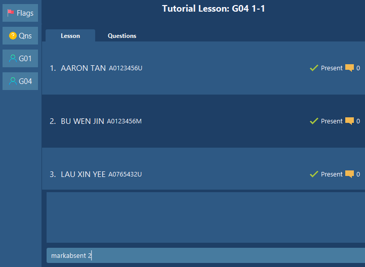

<i>Figure 4.2.2.1 Command for <code>markabsent</code> command.</i>

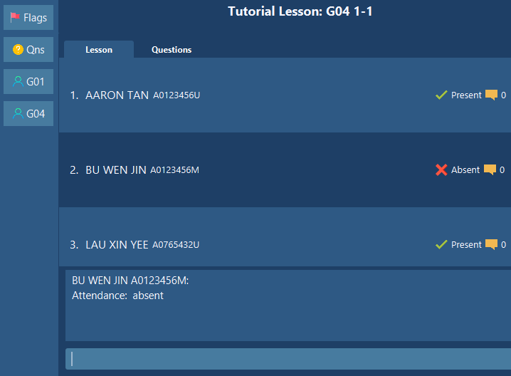

<i>Figure 4.2.2.2 Screen displayed when the command is successfully executed.</i>

#### 4.2.3. Mark all students as absent: `markabsent all`

Accidentally marked all the students as present and want to make them back absent? You can use this command to mark 
all students in a tutorial group back as absent for a tutorial lesson.

**Format:** 
`markabsent all`

**Example:**

All students in group `G04` are present for your tutorial lesson `1-2` of tutorial group `G04`. 

Marking all students in a tutorial group as absent for a tutorial lesson:

1. Navigate to view group `G04` lesson `1-2` via [`viewlsn`](#452-view-a-tutorial-lesson-viewlsn) command.
2. Type `markabsent all` into the *Command Box*.
3. Press `Enter` to execute.

Outcome:

1. The _Result Display_ will show a success message.
2. You can now see that all the students' attendance have been updated on the _Student Information Panel_.

#### 4.2.4. Flag attendance of a student: `flagatt`

You can use this command to flag attendance of a specific student so you can remember to check the student's
attendance at the end of class.

**Format:**
 `flagatt name/NAME matric/STUDENT_NUMBER`
 `flagatt INDEX`

**Example:**

A student named `Aaron Tan` with student number `A0123456U` from your tutorial group `G04` decided to join
another group for tutorial lesson `1-2`. You want to flag his attendance so that you can remember to check with the 
other tutor later on. `Aaron Tan` is the first person on the student list so his `index` number is 1. 

<ins>Method 1</ins>  
Flagging a student's attendance for a tutorial lesson by his `name` and `student number`:

1. Navigate to view group G04 lesson 1-2 via  [`viewlsn`](#452-view-a-tutorial-lesson-viewlsn) command.
2. Type `flagatt name/AARON TAN matric/A0123456U` into the _Command Box_.
3. Press `Enter` to execute.

<ins>Method 2</ins> 
Flagging a student's attendance for a tutorial lesson by his `index` number:

1. Navigate to view group G04 lesson 1-2 via  [`viewlsn`](#452-view-a-tutorial-lesson-viewlsn) command.
2. Type `flagatt 1` into the _Command Box_.
3. Press `Enter` to execute.

Outcome:

1. The _Result Display_ will show a success message.
2. His attendance will now be flagged for future follow-up actions.

#### 4.2.4. Unflag attendance of a student: `unflagatt`

You can use this command to unflag attendance of a specific student that was flagged after you have checked whether the 
student attended a replacement class.

**Format:**
 `unflagatt name/NAME matric/STUDENT_NUMBER`
 `unflagatt 1`

**Example:**

A student named `Aaron Tan` with student number `A0123456U` from your tutorial group `G04` decided to go for 
another tutorial class for lesson `1-2`. You previously flagged his attendance and you now want to unflag it
after checking that he has attended the replacement class. `Aaron Tan` is the first person on the student list 
so his `index` number is 1. 

<ins>Method 1</ins>  
Unflagging a student's attendance for a tutorial lesson by his `name` and `student number`:

1. Navigate to view group G04 lesson 1-2 via  [`viewlsn`](#452-view-a-tutorial-lesson-viewlsn) command.
2. Type `unflagatt name/AARON TAN matric/A0123456U` into the _Command Box_.
3. Press `Enter` to execute.

<ins>Method 2</ins> 
Unflagging a student's attendance for a tutorial lesson by his `index` number:

1. Navigate to view group G04 lesson 1-2 via  [`viewlsn`](#452-view-a-tutorial-lesson-viewlsn) command.
2. Type `unflagatt 1` into the _Command Box_.
3. Press `Enter` to execute.

Outcome:

1. The _Result Display_ will show a success message.
2. His attendance will now be unflagged.

#### 4.2.5. Export attendance as XLSX file: `exportatt`

You can use this command to export the attendance sheet of a specific tutorial group as a XLSX file.

> :bulb: **Tip for the `exportatt` command:**
> You can conveniently obtain the soft copy version of the attendance sheet for
> attendance list submission as part of NUS Centre for English Language Communication requirements.

> :memo: **Note regarding the `exportatt` command:**
> The attendance sheet will be saved as a XLSX file named after the tutorial group.
> The file will be saved at the same folder as your **Serenity** application.

**Format**:

`exportatt grp/GROUP_NAME`

**Example**:

You want to export the attendance sheet of tutorial group `G04`.

Exporting attendance sheet of a tutorial group:
1. Type `exportatt grp/G04` into the _Command Box_.
2. Press `Enter` to execute.

Outcome:
1. The _Result Display_ will show a success message.
2. The attendance sheet of tutorial group `G04` will be saved as `G04_attendance.xlsx`.
You can find the XLSX file at the location where your **Serenity** application is located.

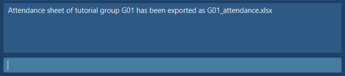

<i>Figure 4.2.5.1 Command for <code>exportatt</code> command.</i>

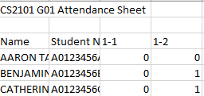

<i>Figure 4.2.5.2 Contents of excel file generated.</i>

### 4.3. Participation marking

Need to keep track of all your students' participation during lessons quickly? This feature allows you to key in a 
student's participation score easily with a scale for reference.

#### 4.3.1. Award participation score for a student: `setscore`

You can use this command to add the participation score for a specific student in a tutorial lesson.

With a scale from 1 to 5:

 | Score   | 1 | 2 | 3 | 4 | 5 |
 |---------|---|---|---|---|---|
 | **Remarks** |Very Poor|Poor|Sufficient|Good|Commendable|

**Format:**
 `setscore name/NAME matric/STUDENT_NUMBER score/SCORE`
 `setscore INDEX score/SCORE`

**Example:**

In tutorial lesson `1-2` of tutorial group `G04`,
you noticed that your student named `Aaron Tan` with student number `A0123456U` often participated in class discussions.
You decided to give him `3` marks for his participation score for this tutorial lesson. `Aaron Tan` is the first person on 
the student list so his `index` number is 1.

<ins>Method 1</ins>  
Set participation score of a student in a tutorial lesson by `name` and `student number`:

1. Navigate to view group G04 lesson 1-2 via  [`viewlsn`](#452-view-a-tutorial-lesson-viewlsn) command.
2. Type `setscore name/AARON TAN matric/A0123456U score/3` into the *Command Box*.
3. Press `Enter` to execute.

<ins>Method 2</ins>  
Set participation score of a student in a tutorial lesson by `index` number:

1. Navigate to view group G04 lesson 1-2 via  [`viewlsn`](#452-view-a-tutorial-lesson-viewlsn) command.
2. Type `setscore 1 score/3` into the *Command Box*.
3. Press `Enter` to execute.

Outcome:

1. The _Result Display_ will show a success message.
2. You can now see that his score has been updated on the _Student Information Panel_.

<i>Figure 4.3.1.1 Command for <code>setscore</code> command.</i>

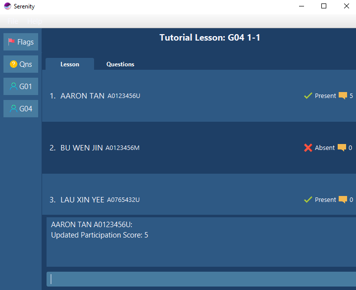

<i>Figure 4.3.1.2 Screen displayed when the command is successfully executed.</i>

#### 4.3.2. Add participation score of a student: `addscore`

You can use this command to increase the participation score of a specific student for a tutorial lesson.

> :warning: **Warning regarding the `addscore` command:**
> You cannot increase the participation score of a student such that the final score is more than 5.
> The maximum score is 5

**Format:**
 `addscore name/NAME matric/STUDENT_NUMBER score/SCORE_TO_ADD`
 `addscore INDEX score/SCORE_TO_ADD`

**Example:**

In tutorial lesson `1-2` of tutorial group `G04`,
you felt that your student named `Aaron Tan` with student number `A0123456U` provided some good insights during lessons. 
You decided to add `1` mark to his participation score for this tutorial lesson. `Aaron Tan` 
is the first person on the student list so his `index` number is 1.

<ins>Method 1</ins>  
Adding participation score of a student in a tutorial lesson by `name` and `student number`:

1. Navigate to view tutorial lesson `1-2` of tutorial group `G04` via  [`viewlsn`](#452-view-a-tutorial-lesson-viewlsn) command.
2. Type `addscore name/AARON TAN matric/A0123456U score/1` into the _Command Box_.
3. Press `Enter` to execute.

<ins>Method 2</ins>  
Adding participation score of a student in a tutorial lesson by `index`number:

1. Navigate to view tutorial lesson `1-2` of tutorial group `G04` via  [`viewlsn`](#452-view-a-tutorial-lesson-viewlsn) command.
2. Type `addscore 1 score/1` into the _Command Box_.
3. Press `Enter` to execute.

Outcome:

1. The _Result Display_ will show a success message.
2. You can now see that his score has been updated on the _Student Information Panel_.

#### 4.3.2. Subtract participation score of a student: `subscore`

You can use this command to decrease the participation score of a specific student for a tutorial lesson.

> :warning: **Warning regarding the `subscore` command:**
> You cannot decrease the participation score of a student such that the final score is less than 0.
> The maximum score you can subtract is 5.

**Format:**

 `subscore name/NAME matric/STUDENT_NUMBER score/SCORE`
 `subscore INDEX score/SCORE`

**Example:**

In tutorial lesson `1-2` of tutorial group `G04`,
you felt that your student named `Aaron Tan` with student number `A0123456U` did not provide insightful responses 
to some questions. You decided to subtract `1` mark from his participation score for this tutorial lesson. `Aaron Tan` 
is the first person on the student list so his `index` number is 1.

<ins>Method 1</ins>  
Subtracting participation score of a student in a tutorial lesson by `name` and `student number`:

1. Navigate to view tutorial lesson `1-2` of tutorial group `G04` via  [`viewlsn`](#452-view-a-tutorial-lesson-viewlsn) command.
2. Type `subscore name/AARON TAN matric/A0123456U score/1` into the _Command Box_.
3. Press `Enter` to execute.

<ins>Method 2</ins>  
Subtracting participation score of a student in a tutorial lesson:

1. Navigate to view tutorial lesson `1-2` of tutorial group `G04` via  [`viewlsn`](#452-view-a-tutorial-lesson-viewlsn) command.
2. Type `subscore 1 score/1` into the _Command Box_.
3. Press `Enter` to execute.

Outcome:

1. The _Result Display_ will show a success message.
2. You can now see that his score has been updated on the _Student Information Panel_.

#### 4.3.3. Export participation scores as XLSX file: `exportscore`

You can use this command to export the participation score sheet of a specific tutorial group as a XLSX file.

> :memo: **Note regarding the `exportscore` command:**
> The participation score sheet will be saved as a XLSX file named after the tutorial group.
> The file will be saved at the same folder as your **Serenity** application.

**Format:**

`exportscore grp/GROUP_NAME`

**Example:**

You want to collate the participation scores of tutorial group `GO7` into a XLSX file for grading on a 
different platform (i.e. LumiNUS).

Exporting participation score sheet of a tutorial group:

1. Type `exportscore grp/G07` into the _Command Box_.
2. Press `Enter` to execute.

Outcome:

1. The _Result Display_ will show a success message.
2. The participation score sheet of tutorial group `G04` will be saved as `G04_participation.xlsx`.
You can find the XLSX file at the location where your **Serenity** application is located.

### 4.4. Question addressing

Need to keep track of all your students' questions during lessons quickly? This feature allows you to key in questions
easily for future reference.

#### 4.4.1. Add a new question: `addqn`

You can use this command to add a question that was asked in a tutorial lesson, so that you can address the question
in the future.

**Format:**

`addqn qn/QUESTION`

**Example:**

A student asked you, "`What is the deadline for the report?`" during the lesson `1-1` in group `G04`.
As the deadline of the report has changed, you want to note this question down, check the new deadline and
address the question in the future. 

Adding a question:

1. Navigate to view group `G04` lesson `1-1` via [`viewlsn`](#452-view-a-tutorial-lesson-viewlsn) command.
1. Type `addqn qn/What is the deadline for the report?` into the _Command Box_.
1. Press `Enter` to execute.

Outcome:

1. The _Result Display_ will show a success message.
2. The question will be added to the list of questions.

Figure 4.4.1.1 Command for <code>addqn</code> command

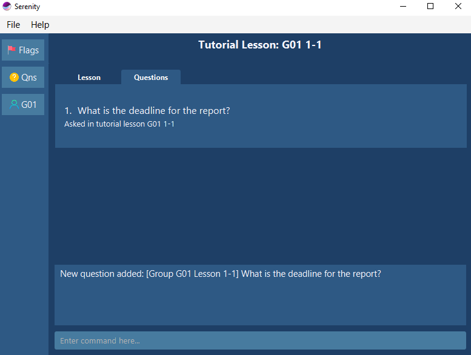

<i>Figure 4.4.1.2 Screen displayed when the command is successfully executed.</i>

#### 4.4.2. Delete an existing question: `delqn`

You can use this command to delete a question after addressing it.

**Format:**

`delqn INDEX`

**Example:**

You addressed one of the questions at the end of a tutorial lesson and you want to delete the question from the
list of questions.

Deleting a question:

1. Type `delqn 1` into the _Command Box_.
2. Press `Enter` to execute.

Outcome:

1. The _Result Display_ will show a success message.
2. The question will be deleted from the list of questions.

#### 4.4.3. Edit an existing question: `editqn`

You can use this command to edit an existing question that was asked in a tutorial lesson.

**Format:**

`editqn INDEX [grp/GROUP_NAME] [lsn/LESSON_NAME] [qn/QUESTION]`

> :memo: **Note regarding the `editqn` command:**
> * You can edit the question's description, or the group/lesson the question was asked in.
> * The existing values will be updated to the new values.
> * If `grp/GROUP_NAME` or `lsn/LESSON_NAME` is supplied, ensure that the group or lesson exists.
> Otherwise, an error message will be displayed to alert you.

**Example:**

Suppose you have accidentally made a spelling mistake in the `second` question in the displayed list and 
wish to change it from "`What is the dedline for the report?`" to "`What is the deadline for the report?`". 
You can do so as follows.

Editing a question:

1. Type `editqn 2 qn/What is the deadline for the report?` into the _Command Box_.
2. Press `Enter` to execute.

Outcome:

1. The _Result Display_ will show a success message.
2. The _Data Display_ will update and display the list of all your questions, including the edited question.

#### 4.4.4. Find questions by keywords: `findqn`

You can use this command to find a question that was asked in a tutorial lesson. 
Serenity will help you search for questions that contain the keywords that you are finding.

**Format:**

`findqn KEYWORD [MORE_KEYWORDS]...`

**Example:**

Let say your question list has a bunch of questions from all your tutorial lessons. 
You want to search for a specific one with the word `deadline` in the question. You can do so as follows.

Finding questions:

1. Type `findqn deadline` into the _Command Box_.
2. Press `Enter` to execute.

Outcome:

1. The _Result Display_ will show a success message.
2. The _Data Display_ will update and display the list of questions with the keyword `deadline`.

### 4.5 Utility viewing

The following commands allow you to navigate between different views.

#### 4.5.1. View a tutorial group: `viewgrp`

You can use this command to view the list of students and tutorial lessons of a tutorial group.
You will also be able to execute tutorial group-related commands.

**Format:**

`viewgrp grp/GROUP_NAME`

**Example:**

You want to view the details of tutorial group `G04`.

Viewing a tutorial group:

1. Type `viewgrp grp/G04` into the _Command Box_.
2. Press `Enter` to execute.

Outcome:

1. The _Result Display_ will show a success message.
2. The _Data Display_ will update and display the information for tutorial group `G04`.

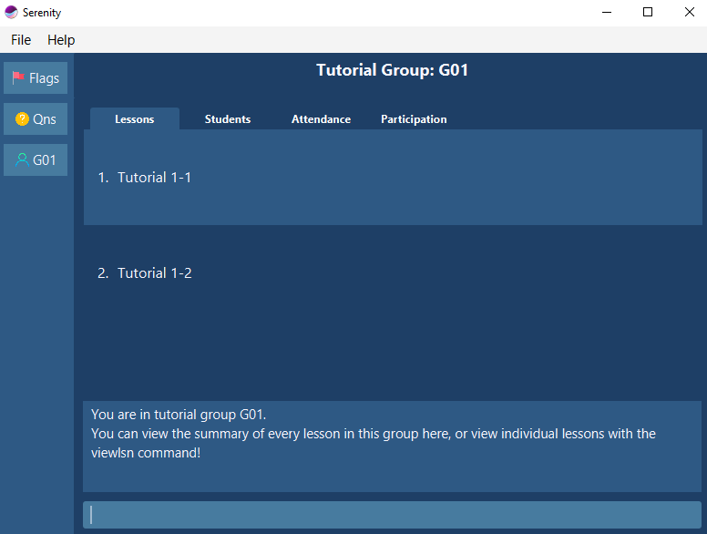

<i>Figure 4.5.1.1 User interface for viewing tutorial group.</i>

#### 4.5.2. View a tutorial lesson: `viewlsn`

You can use this command to view and modify the attendance and participation scores of 
a tutorial lesson. You will also be able to execute tutorial lesson-related commands.

**Format:**

`viewlsn grp/GROUP_NAME lsn/LESSON_NAME`

**Example:**

You want to view the details of tutorial lesson `1-2` of tutorial group `G04`.

Viewing a tutorial lesson:

1. Type `viewlsn grp/G04 lsn/1-2` into the _Command Box_.
2. Press `Enter` to execute.

Outcome:

1. The _Result Display_ will show a success message.
2. The _Data Display_ will update and display the students' information for tutorial lesson `1-2` of tutorial group `G04`.

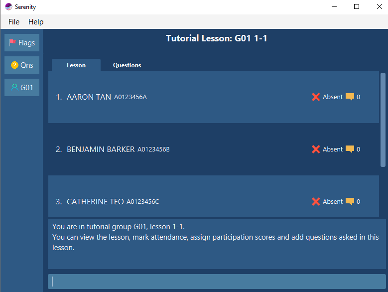

<i>Figure 4.5.2.1 User interface for viewing tutorial lesson.</i>

#### 4.5.3. View attendance sheet of a tutorial group: `viewatt`

You can use this command to view the attendance sheet of the students in a tutorial group across all tutorial lessons.
The attendance sheet will be displayed in table form.

> :memo: **Note regarding the `viewatt` command:**
> You can view the attendance of all your students in the tutorial group at one glance.
> You can also preview the XLSX file that you can generate with the `exportatt` command,
> before generating the actual XLSX file.

**Format:**

`viewatt grp/GROUP_NAME`

**Example:**

You want to view the attendance sheet of the students in tutorial group `G04`.

Viewing the attendance sheet of a tutorial lesson:

1. Type `viewatt grp/G04` into the _Command Box_.
2. Press `Enter` to execute.

Outcome:

1. The _Result Display_ will show a success message.
2. The _Data Display_ will update and display the attendance sheet of tutorial group `G04`.

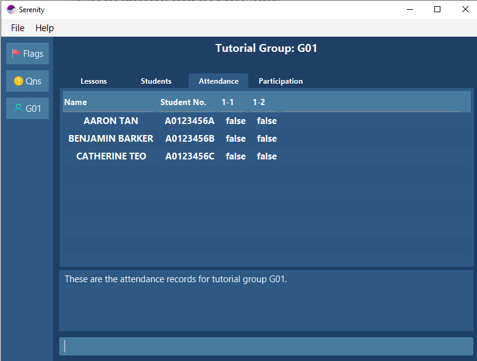

<i>Figure 4.5.3.1 User interface for viewing tutorial attendance.</i>

#### 4.5.4. View participation score sheet of a tutorial group: `viewscore`

You can use this command to view the participation score sheet of the students in a tutorial group
across all tutorial lessons. The participation score sheet will be displayed in table form.

> ℹ **Note regarding the `viewscore` command:**
> In a similar way to the `viewatt` command,
> you can view the participation score of all your students in the tutorial group at one glance.
> You can also preview the XLSX file that you can generate with the `exportscore` command,
> before generating the actual XLSX file.

**Format:**

`viewscore grp/GROUP_NAME`

**Example:**

You want to view the participation score sheet of the students in tutorial group `G04`.

Viewing the participation score sheet of a tutorial lesson:

1. Type `viewscore grp/G04` into the _Command Box_.
2. Press `Enter` to execute.

Outcome:

1. The _Result Display_ will show a success message.
2. The _Data Display_ will update and display the participation score sheet of tutorial group `G04`.

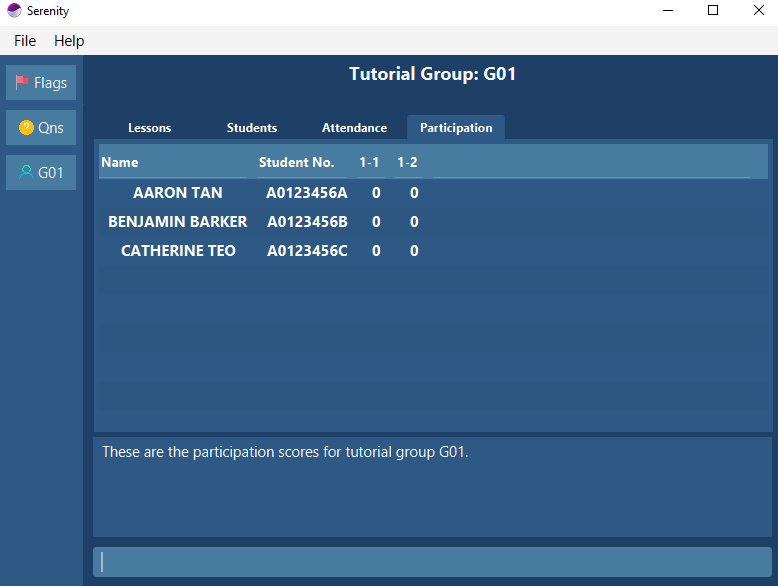

<i>Figure 4.5.4.1 User interface for viewing tutorial participation score sheet.</i>

#### 4.5.5. View all pending questions: `viewqn`

You can use this command to view all questions that have yet to be addressed.

**Format:**

`viewqn`

**Example:**

You want to view all pending questions.

Viewing all pending questions:

1. Type `viewqn` into the _Command Box_.
2. Press `Enter` to execute.

Outcome:

1. The _Result Display_ will show a success message.
2. The _Data Display_ will update and display the list of pending questions.

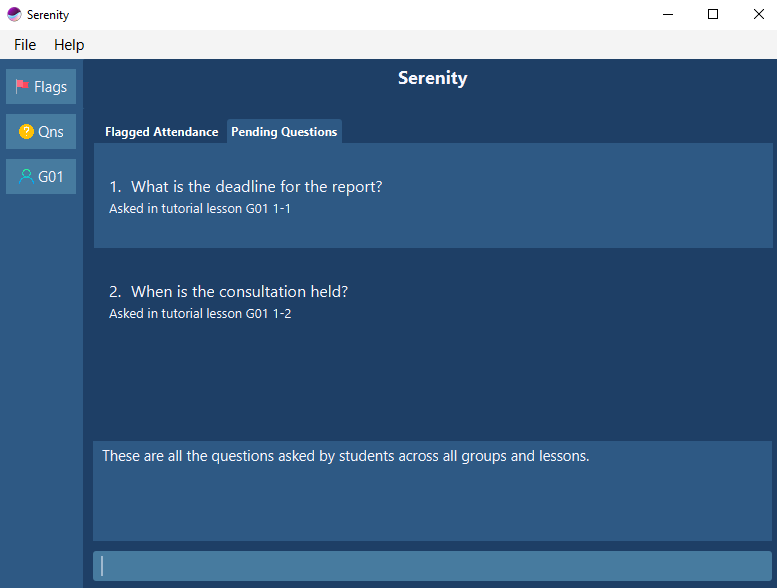

<i>Figure 4.5.5.1 User interface for viewing questions.</i>

--------------------------------------------------------------------------------------------------------------------

## **5. FAQ**

**Q:** How many tutorial groups can I manage in **Serenity**?

**A:** You can manage more than 1 tutorial groups in **Serenity**.

**Q:** How do I transfer my data to another computer?

**A:** By default, **Serenity** saves all your data in a folder named `data`. This folder can be found in the
home folder for your **Serenity** application. You can copy and transfer the data folder into the home folder of
your **Serenity** application on your other computer. **Serenity** will automatically load your data upon launching.

--------------------------------------------------------------------------------------------------------------------

## **6. Command summary**

### 6.1. Setup commands 

Command | Example
------------ | -------------
**Add tutorial group**  `addgrp grp/GROUP_NAME path/PATH_TO_XLSX`|  `addgrp grp/G04 path/C:\Users\serene\CS2101_G04.xlsx`
**Delete tutorial group**   `delgrp grp/GROUP_NAME`|  `delgrp grp/G04`
**Add tutorial lesson**   `addlsn grp/GROUP_NAME lsn/LESSON_NAME` |  `addlsn grp/G04 lsn/1-2`
**Delete tutorial lesson**   `dellsn grp/GROUP_NAME lsn/LESSON_NAME` |  `dellsn grp/G04 lsn/1-3`
**Add student**   `addstudent grp/GROUP_NAME name/NAME matric/STUDENT_NUMBER` |  `addstudent grp/G04 name/AARON TAN matric/A0123456U`
**Delete student**   - `delstudent grp/GROUP_NAME name/NAME matric/STUDENT_NUMBER`  - `delstudent INDEX grp/GROUP` |   - `delstudent grp/G04 name/AARON TAN matric/A0123456U`   - `delstudent 1 grp/G04`

### 6.2. Attendance taking commands

Command | Example
------------ | -------------
**Mark a student as present**   - `markpresent name/NAME matric/STUDENT_NUMBER`  - `markpresent INDEX` |   - `markpresent name/AARON TAN matric/A0123456U`   - `markpresent 1`
**Mark a student as absent**   - `markabsent name/NAME matric/STUDENT_NUMBER` -`markabsent INDEX` |   - `markabsent name/AARON TAN matric/A0123456U`  - `markabsent 1`
**Mark all students as present**   `markpresent all` |  `markpresent all`
**Mark all students as absent**   `markabsent all` |  `markabsent all`
**Flag attendance**   - `flagatt name/NAME matric/STUDENT_NUMBER`   - `flagatt INDEX` |   - `flagatt name/AARON TAN matric/A0123456U`   - `flagatt 1`
**Unflag attendance**   - `unflagatt name/NAME matric/STUDENT_NUMBER`   - `unflagatt INDEX` |   - `unflagatt name/AARON TAN matric/A0123456U`  - `unflagatt 1` 
**Export attendance**   `exportatt grp/GROUP_NAME` | `exportatt grp/G04`

### 6.3. Participation marking commands

Command | Example
------------ | -------------
**Set participation score**   - `setscore name/NAME matric/STUDENT_NUMBER score/SCORE`   - `setscore INDEX score/SCORE` |  - `setscore name/AARON TAN matric/A0123456U score/3`   - `setscore 1 score/3`
**Add participation score**   - `addscore name/NAME matric/STUDENT_NUMBER score/SCORE`  - `addscore INDEX score/SCORE` |  - `addscore name/AARON TAN matric/A0123456U score/3`   - `addscore 1 score/3`
**Subtract participation score**   - `subscore name/NAME matric/STUDENT_NUMBER score/SCORE`   - `subscore INDEX score/SCORE` |  - `subscore name/AARON TAN matric/A0123456U score/3`   - `subscore 1 score/3`
**Export participation scores**   `exportscore grp/GROUP_NAME` |  `exportscore grp/G07`

### 6.4. Question addressing commands 

Command | Example
------------ | -------------
**Add question**   `addqn qn/QUESTION` | `addqn qn/What is the deadline for the report?`
**Delete question**   `delqn INDEX` | `delqn 5`
**Edit question**   `editqn INDEX [grp/GROUP_NAME] [lsn/LESSON_NAME] [qn/QUESTION]` | `editqn 2 qn/What is the deadline for the report?`
**Find question**   `findqn KEYWORD [MORE_KEYWORDS]...` | `findqn deadline`

### 6.5. Utility viewing commands 

Command | Example
------------ | -------------
**View tutorial group**   `viewgrp grp/GROUP_NAME` | `viewgrp grp/G04`
**View tutorial lesson**   `viewlsn grp/GROUP_NAME lsn/LESSON_NAME` | `viewlsn grp/G04 lsn/1-2`
**View attendance**   `viewatt grp/GROUP_NAME` | `viewatt grp/G04`
**VIew participation score**   `viewscore grp/GROUP_NAME` | `viewscore grp/G04`
**View questions**   `viewqn` | `viewqn`
