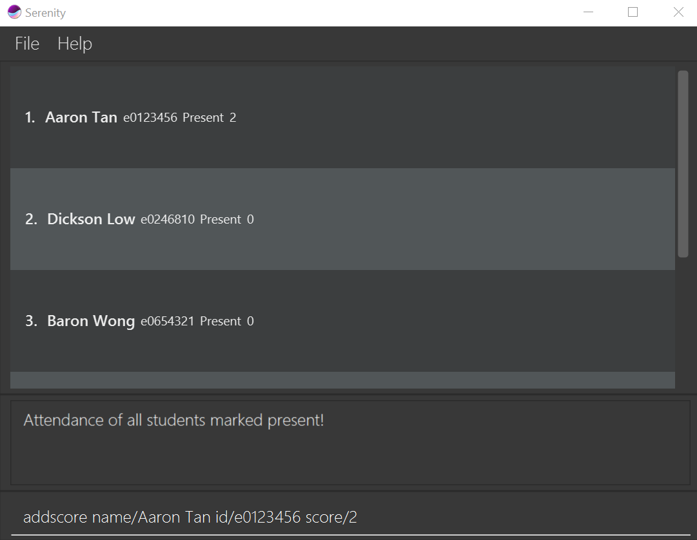

# Serenity - User Guide

By: `Team Serenity` Since: `Aug 2020`

1. [Introduction](#introduction)

2. [Quick Start](#quick-start)

3. [About](#about)

4. [Features](#features)

   4.1. [Setup](#setup)

     * [Setup classes at the start of a semester: `importCsv`](#setup-classes-at-the-start-of-a-semester-importcsv)

   4.2. [Attendance Taking](#attendance-taking)

     * [Mark attendance for every student: `markpresent all`](#mark-attendance-for-every-student-markpresent-all)

     * [Mark attendance for a single student: `markpresent`](#mark-attendance-for-a-single-student-mark)

     * [Flag attendance for a single student: `flag`](#flag-attendance-for-a-single-student-flag)

     * [View attendance for a each class: `attendance`](#view-attendance-for-each-class-attendance)

     * [Exporting of attendance to CSV: `exportAtt`](#exporting-of-attendance-to-csv-exportatt)

   4.3. [Class Participation](#class-participation)

     * [Awarding class participation marks: `award`](#awarding-class-participation-marks-award)

     * [Viewing statistics of class participation `stats`](#viewing-statistics-of-class-participation-stats)

     * [Exporting of class participation grades to CSV: `exportCp`](#exporting-of-class-participation-grades-to-csv-exportcp)

   4.4 [Addressing Questions](#addressing-questions)

     * [Adding a question: `addQn`](#adding-a-question-addqn)

     * [Viewing all questions: `questions`](#viewing-all-questions-list)

     * [Deleting a question: `deleteQn`](#deleting-a-question-deleteqn)

     * [Marking a question as answered: `ansQn`](#marking-a-question-as-answered-ansqn)

5. [FAQ](#faq)

6. [Command Summary](#command-summary)

## Introduction

Welcome to the User Guide of **Serenity**!

Are you a tutor for CS2101, but annoyed at keeping track of attendance, questions and class participation grades on different 
excel sheets for different classes? Fret not, our application, **Serenity**, will help keep you sane when doing the necessary 
administrative work. **Serenity** is a desktop application that helps CS2101 tutors **manage their classes**. This  
application is optimized for use through a *Command Line Interface(CLI)*, meaning that you operate the application by 
typing commands into a command box.

This user guide serves to provide you with an in-depth documentation on how to set up and use our application. with that said
let's get [started](#quick-start)!

## Quick start

1. Ensure you have Java `11` or above installed in your Computer.

2. Download the latest `Serenity.jar` from [here]().

3. Copy the file to the folder you want to use as the _home folder_ for your AddressBook.

4. Double-click the file to start the app. The GUI similar to the below should appear in a few seconds. Note how the app contains some sample data. 
   

5. Type the command in the command box and press Enter to execute it. 

6. Refer to the [Features](#features) below for details of each command.

--------------------------------------------------------------------------------------------------------------------

## About

about goes here

--------------------------------------------------------------------------------------------------------------------

## Features

### <ins>Setup</ins>

#### Set up classes at the start of a semester: `importCsv`

You can set up classes automatically by importing CSV data.

1. Copy and paste CSV file into home folder. 
2. Enter `importCsv` in the command line.
3. The program will update the classes and students for you.
4. The program is now ready to assist you in managing your CS2101 class.

---

### <ins>4.2. Attendance Taking</ins>

Just before you start the lesson, it will be nice to be able to quickly take the attendance of every student in the 
class so that you won't have to worry about it afterwards. This feature allows you to mark the attendance of all 
students at once upon checking that all students are present, so the class can start without much hassle.

#### 4.2.1. Mark a single student as present: `markpresent`
You can use this command to mark a specific student present for a tutorial lesson.

**Format:**
`markpresent name/NAME id/STUDENT_ID`

**Example:**

There is a student named `Aaron Tan` with Student ID of `e0123456` who is present for the tutorial lesson `1-2` of group `G04`. 

To mark him present:
1. Navigate to view group G04 lesson 1-2 via  command.
2. Type `markpresent name/Aaron Tan id/e0123456` into the *Command Box*.
3. Press `Enter` to execute.

Outcome:
1. The *Result Display* will show a success message.
2. You can now see that his attendance has been updated on the *Student Information Panel*.

_Figure X. Outcome of a successful mark a student present command_

#### 4.2.2. Mark a single student as absent: `markabsent`
You can use this command to mark a specific student absent for a tutorial lesson.

**Format:**
`markabsent name/NAME id/STUDENT_ID`

**Example:**

There is a student `Aaron Tan` with Student ID `e0123456` from group `G04` who is absent for your tutorial lesson `1-2`. 

To mark him absent:
1. Navigate to view group G04 lesson 1-2 via  command.
2. Type `markabsent name/Aaron Tan id/e0123456` into the *Command Box*.
3. Press `Enter` to execute.

Outcome:
1. The *Result Display* will show a success message.
2. You can now see that his attendance has been updated on the *Student Information Panel*.

_Figure X. Outcome of a successful mark a student absent command_

#### 4.2.3. Mark attendance for all students: `markpresent all`
You can use this command to mark all students present for a tutorial lesson.

**Format:**
`markpresent all`

**Example:**

All students in group `G04` are present for the tutorial lesson `1-2`. 

To mark all of them present at once:
1. Navigate to view group `G04` lesson `1-2` via  command.
2. Type `markpresent all` into the *Command Box*.
3. Press `Enter` to execute.

Outcome:
1. The *Result Display* will show a success message.
2. You can now see that all the students' attendance have been updated on the *Student Information Panel*.

_Figure X. Outcome of a successful mark attendance for all students command_

#### Flag attendance for a single student: `flag`

Flag attendance so you will be reminded to check again 
at the end of class.

Format: `flag TUTORIAL_GROUP LESSON_NUMBER NAME`

Examples:
 * flag G04 1-1 john
 * flag G09 7-2 ryan

Outcome:

#### View attendance for each class: `attendance`

Provides a graphical view of all the student's 
attendance for a particular lesson.

Format: `attendance TUTORIAL_GROUP LESSON_NUMBER`

Examples:
 * attendance G04 1-1
 * attendance G09 7-2

Outcome:

#### Exporting of attendance to CSV: `exportAtt`

Export the attendance for a particular tutorial group 
in a CSV file.

Format: `exportAtt TUTORIAL_GROUP`

File will be saved where your JAR file is located, with the file name
`TUTORIAL_GROUP.csv`.

Examples:
 * `exportAtt G04` saves the file as `G04.csv`
 * `exportAtt G09` saves the file as `G09.csv`

Outcome:

---

### <ins>4.3. Participation Marking</ins>

Need to keep track of all your students' participation during lessons quickly? This feature allows you to key in a 
student's participation score easily with a scale for reference.

#### 4.3.1. Award participation score for a student: `addscore`
You can use this command to add the participation score for a specific student in a tutorial lesson.

With a scale from 1 to 5:
Score | 1 | 2 | 3 | 4 | 5 | 
------|---|---|---|---|---
**Remark** |Very Poor| Poor| Sufficient|Good|Commendable

**Format:**
`addscore MARK name/NAME id/STUDENT_ID`

**Example:**

After **lesson 1-2**, you felt that your student `Aaron Tan` with Student ID `e0123456`  from **group G04** participated sufficiently in class but could be more active, you would like to give him a `3` for his participation.

To give him a score:
1. Navigate to view group G04 lesson 1-2 via  command.
2. Type `addscore 3 name/Aaron Tan id/e0123456` into the *Command Box*.
3. Press `Enter` to execute.

Outcome:
1. The *Result Display* will show a success message.
2. You can now see that his score has been updated on the *Student Information Panel*.

_Figure X. Outcome of a successful add score for a student command_

#### Viewing statistics of class participation: `stats`

you can use this command to view the average score for each student for a specific tutorial group and tutorial.

##### Format:

`stats TUTORIAL_GROUP LESSON_NUMBER`

##### Example:

If you wish to view the average participation marks for tutorial group `GO9` and tutorial `7-2`, follow the steps below 
to learn how. 

Viewing the average class participation mark

1. Type `stats G09 7-2`

2. Press `enter` to execute the command 

Outcome:

#### Exporting of class participation grades to CSV: `exportCp`

You can use this command to export the class participation marks of a specified tutorial group into a CSV file.

##### Format:

`exportcp TUTORIAL_GROUP`

##### Example:

Assuming you need to collate the class participation marks for tutorial group `GO7` into a CSV file for grading on a 
different platform (i.e LuimiNUS). You can do the following steps

Exporting class participation marks:

1. Type `exportcp G07`

2. Press `enter` to execute the command 

Outcome:

---

### <ins>Addressing Questions</ins>

#### Adding a question: `addQn`

Adds a question to the list of questions of a specified tutorial group.

##### Format:

`addQn TUTORIAL_GROUP LESSON_NUMBER QUESTION_DESCRIPTION`

##### Examples:
* `addQn G07 7-1 Could you elaborate on the marking scheme for OP1?`
* `addQn G07 7-1 What are the deadlines that students should take note of?`

Outcome:

#### Viewing all questions: `questions`

View a list of all the questions from a specified tutorial group.

##### Format:

`questions TUTORIAL_GROUP LESSON_NUMBER`

##### Examples:
* `questions G07 7-1`
* `questions G10 5-2`

Outcome:

#### Deleting a question: `deleteQn`

Deletes the specific question from the list of questions of a specified tutorial group.

##### Format:

`deleteQn TUTORIAL_GROUP LESSON_NUMBER INDEX`
* Deletes the question at the specified `INDEX`.
* The index refers to the index number shown in the displayed question list.
* The index **must be a positive integer** 1, 2, 3, …​

##### Examples:
* `deleteQn G07 7-1 1`
* `deleteQn G10 5-2 3`

Outcome:

#### Marking a question as answered: `ansQn` 

Marks the specified question from the list of questions of a specified tutorial group as answered.

##### Format:

`ansQn TUTORIAL_GROUP LESSON_NUMBER INDEX`
* Marks the question at the specified `INDEX` as answered.
* The index refers to the index number shown in the displayed question list.
* The index **must be a positive integer** 1, 2, 3, …​

##### Examples:
* `ansQn G07 7-1 1`
* `ansQn G10 5-2 3`

Outcome:

--------------------------------------------------------------------------------------------------------------------

## FAQ

--------------------------------------------------------------------------------------------------------------------

## Command summary

Action | Format, Examples
--------|------------------
Add New Tutorial Group | For a tutorial group - Format: `importCsv`
Mark/Unmark Attendance | For an individual student - Format: `mark TUTORIAL_GROUP LESSON_NUMBER NAME` Example:`mark G04 1-2 ryan` For every student in a tutorial class - Format: `markAll TUTORIAL_GROUP LESSON_NUMBER` Example: `markAll G04 1-2`
Flag Attendance | For an individual student - Format: `flag TUTORIAL_GROUP LESSON_NUMBER NAME` Example: `flag G04 1-2 ryan`
View Attendance | For a tutorial group - Format: `attendance TUTORIAL_GROUP LESSON_NUMBER` Example: `attendance G04 1-2`
Export Attendance | For a tutorial group - Format: `exportAtt TUTORIAL_GROUP` Example: `exportAtt G04`
Award Participation Score | For an individual student - Format: `award TUTORIAL_GROUP LESSON_NUMBER NAME MARKS` Example: `award G04 1-2 ryan 3`
View Average Participation Score (across tutorial weeks) | For a tutorial group - Format: `stats TUTORIAL GROUP LESSON_NUMBER` Example: `stats G04 1-2`
Export Participation Score | For a tutorial group - Format: `exportCp TUTORIAL_GROUP` Example: `exportCp G04`
Add A Question | Across all tutorial groups - Format: `addQn QUESTION_DESCRIPTION` Example: `addQn What are the deadlines that students should take note of?`
View All Questions | Across all tutorial groups - Format: `list`
Delete A Question | Across all tutorial groups - Format: `deleteQn INDEX` Example: `deleteQn 1`
Mark A Question As Answered | Across all tutorial groups - Format: `ansQn INDEX` Example: `ansQn 1`
