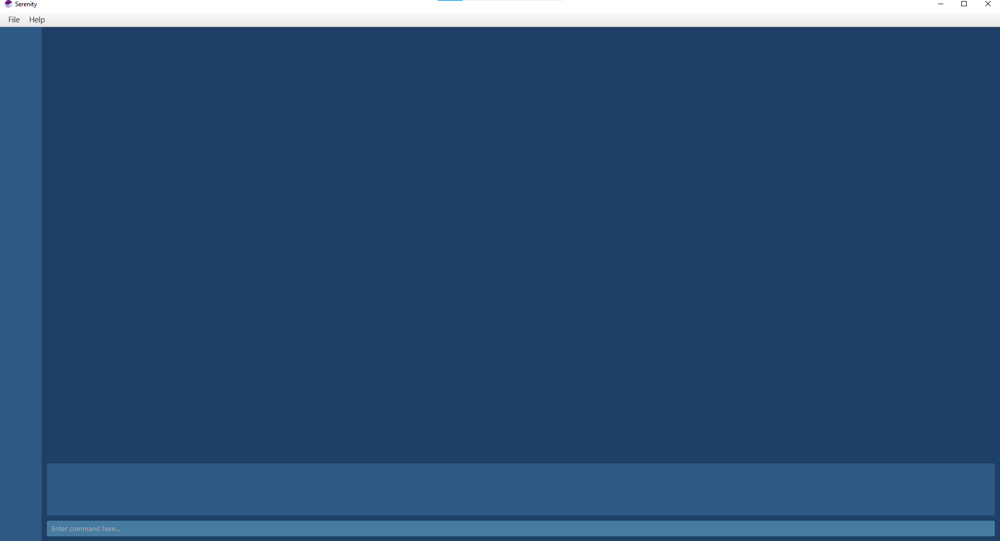

# Serenity - User Guide

By: `Team Serenity` Since: `Aug 2020`

1. [Introduction](#introduction)

2. [Quick Start](#quick-start)

3. [About](#about)

4. [Features](#features)

   4.1. [Setup](#setup)

     * [Setup classes at the start of a semester: `importCsv`](#setup-classes-at-the-start-of-a-semester-importcsv)

   4.2. [Attendance Taking](#attendance-taking)

     * [Mark attendance for a every student: `markAll`](#mark-attendance-for-every-student-markall)

     * [Mark attendance for a single student: `mark`](#mark-attendance-for-a-single-student-mark)

     * [Flag attendance for a single student: `flag`](#flag-attendance-for-a-single-student-flag)

     * [View attendance for a each class: `attendance`](#view-attendance-for-each-class-attendance)

     * [Exporting of attendance to CSV: `exportAtt`](#exporting-of-attendance-to-csv-exportatt)

   4.3. [Class Participation](#class-participation)

     * [Awarding class participation marks: `award`](#awarding-class-participation-marks-award)

     * [Viewing statistics of class participation `stats`](#viewing-statistics-of-class-participation-stats)

     * [Exporting of class participation grades to CSV: `exportCp`](#exporting-of-class-participation-grades-to-csv-exportcp)

   4.4. [Question Addressing](#ins44-question-addressingins)
       
      4.4.1. [Adding a question: `addQn`](#441-add-a-new-question-addqn)

      4.4.2. [Deleting a question: `deleteQn`](#442-delete-an-existing-question-delqn)

   4.5. [Utility](#ins45-utilityins)
   
      4.5.2. [View an existing tutorial lesson: `viewlsn`](#452-view-an-existing-tutorial-lesson-viewlsn)

5. [FAQ](#faq)

6. [Command Summary](#command-summary)

## Introduction

Welcome to the User Guide of **Serenity**!

Are you a tutor for CS2101, but annoyed at keeping track of attendance, questions and class participation grades on different 
excel sheets for different classes? Fret not, our application, **Serenity**, will help keep you sane when doing the necessary 
administrative work. **Serenity** is a desktop application that helps CS2101 tutors **manage their classes**. This  
application is optimized for use through a *Command Line Interface(CLI)*, meaning that you operate the application by 
typing commands into a command box.

This user guide serves to provide you with an in-depth documentation on how to set up and use our application. with that said
let's get [started](#quick-start)!

## Quick start

1. Ensure you have Java `11` or above installed in your Computer.

2. Download the latest `Serenity.jar` from [here]().

3. Copy the file to the folder you want to use as the _home folder_ for your AddressBook.

4. Double-click the file to start the app. The GUI similar to the below should appear in a few seconds. Note how the app contains some sample data. 
   

5. Type the command in the command box and press Enter to execute it. 

6. Refer to the [Features](#features) below for details of each command.

--------------------------------------------------------------------------------------------------------------------

## About

about goes here

--------------------------------------------------------------------------------------------------------------------

## Features

### <ins>Setup</ins>

#### Set up classes at the start of a semester: `importCsv`

You can set up classes automatically by importing CSV data.

1. Copy and paste CSV file into home folder. 
2. Enter `importCsv` in the command line.
3. The program will update the classes and students for you.
4. The program is now ready to assist you in managing your CS2101 class.

---

### <ins>Attendance Taking</ins>

#### Mark attendance for every student: `markAll`
Marks all students of a particular class for a single tutorial 
session as present.

Format:  `markAll TUTORIAL_GROUP LESSON_NUMBER`

Examples:
* `markAll G04 1-1`
* `markAll G09 7-2`

#### Mark attendance for a single student as absent: `mark`

Marks a student of a particular class for a 
single tutorial session as absent.

Format: `mark TUTORIAL_GROUP LESSON_NUMBER NAME`

*TIP*: Use `markAll` to mark all students as present first, then use
`mark` to mark just the students who are absent for a quick
and easy way to record attendance.

Examples:
* `mark G04 1-1 john`
* `mark G09 7-2 ryan`

Outcome:

#### Flag attendance for a single student: `flag`

Flag attendance so you will be reminded to check again 
at the end of class.

Format: `flag TUTORIAL_GROUP LESSON_NUMBER NAME`

Examples:
 * flag G04 1-1 john
 * flag G09 7-2 ryan

Outcome:

#### View attendance for each class: `attendance`

Provides a graphical view of all the student's 
attendance for a particular lesson.

Format: `attendance TUTORIAL_GROUP LESSON_NUMBER`

Examples:
 * attendance G04 1-1
 * attendance G09 7-2

Outcome:

#### Exporting of attendance to CSV: `exportAtt`

Export the attendance for a particular tutorial group 
in a CSV file.

Format: `exportAtt TUTORIAL_GROUP`

File will be saved where your JAR file is located, with the file name
`TUTORIAL_GROUP.csv`.

Examples:
 * `exportAtt G04` saves the file as `G04.csv`
 * `exportAtt G09` saves the file as `G09.csv`

Outcome:

---

### <ins>Class Participation</ins>

This feature allows you to manage the class participation grades for each student in your classes.

#### Awarding class participation marks: `award`

you can use this command to award class participation marks to a student from a specified tutorial group and tutorial 
you wish to grade.

##### Format:

`award NAME TUTORIAL_GROUP TUTORIAL_NUMBER MARKS`

##### Example:

If you wish to award a student participation marks, follow the steps below to learn how. In this example you will learn
how to award a student ,`Ryan`, from tutorial group `G04`, a class participation score of `4` for tutorial `3-1`.

Awarding class participation:

1. Type `award Ryan G04 3-1 4`

2. Press `enter` to execute the command 

Outcome:

#### Viewing statistics of class participation: `stats`

you can use this command to view the average score for each student for a specific tutorial group and tutorial.

##### Format:

`stats TUTORIAL_GROUP LESSON_NUMBER`

##### Example:

If you wish to view the average participation marks for tutorial group `GO9` and tutorial `7-2`, follow the steps below 
to learn how. 

Viewing the average class participation mark

1. Type `stats G09 7-2`

2. Press `enter` to execute the command 

Outcome:

#### Exporting of class participation grades to CSV: `exportCp`

You can use this command to export the class participation marks of a specified tutorial group into a CSV file.

##### Format:

`exportcp TUTORIAL_GROUP`

##### Example:

Assuming you need to collate the class participation marks for tutorial group `GO7` into a CSV file for grading on a 
different platform (i.e LuimiNUS). You can do the following steps

Exporting class participation marks:

1. Type `exportcp G07`

2. Press `enter` to execute the command 

Outcome:

---

### <ins>4.4. Question Addressing</ins>

Need to keep track of all your students' questions during lessons quickly? This feature allows you to key in questions easily for future references.

#### 4.4.1. Add a new question: `addqn`
You can use this command to add a question that was asked in a lesson, so that you can address the question at the end of the lesson.

**Format:**
`addqn qn/QUESTION`

**Example:**
When teaching group `G04` lesson `1-2`, a student ask a question, and you want to note it down.

To add a question to group `G04` lesson `1-2`:
1. Navigate to view group `G04` lesson `1-2` via [`viewlsn`](#452-view-an-existing-tutorial-lesson-viewlsn) command.
2. Type `addqn qn/What is the deadline for the report?` into the *Command Box*.
3. Press `Enter` to execute.

Outcome:
1. The *Result Display* will show a success message.

#### 4.4.2. Delete an existing question: `delqn`
You can use this command to add a question that was asked in a tutorial lesson, so that you can address the question at the end of the lesson.

**Format:**
`delqn INDEX`

**Example:**
When teaching group `G04` lesson `1-2`, you answered one of the questions and wants to delete it from the list of questions.

To delete a question from group `G04` lesson `1-2`:
1. Navigate to view group `G04` lesson `1-2` via [`viewlsn`](#452-view-an-existing-tutorial-lesson-viewlsn) command.
2. Type `delqn 1` into the *Command Box*.
3. Press `Enter` to execute.

Outcome:
1. The *Result Display* will show a success message.

---

### <ins>4.5 Utility</ins>

#### 4.5.2. View an existing tutorial lesson: `viewlsn`
You can use this command to view the attendance, participation scores and questions of an existing tutorial group. You will also be able to execute tutorial lesson-related commands.

**Format:**
`viewlsn grp/GROUP lsn/LESSON`

**Example:**
Suppose you would like to view the details for tutorial group G04's  **lesson 1-2**. You can perform the following steps.

To view tutorial group G04's **lesson 1-2**:
1. Type `viewlsn grp/G04 lsn/1-2` into the *Command Box*.
2. Press `Enter` to execute.

Outcome:
1. The *Result Display* will show a success message.
2. The *Data Display* will update and display the students' information for tutorial group G04's **lesson 1-2**.

--------------------------------------------------------------------------------------------------------------------

## FAQ

--------------------------------------------------------------------------------------------------------------------

## Command summary

Action | Format, Examples
--------|------------------
Add New Tutorial Group | For a tutorial group - Format: `importCsv`
Mark/Unmark Attendance | For an individual student - Format: `mark TUTORIAL_GROUP LESSON_NUMBER NAME` Example:`mark G04 1-2 ryan` For every student in a tutorial class - Format: `markAll TUTORIAL_GROUP LESSON_NUMBER` Example: `markAll G04 1-2`
Flag Attendance | For an individual student - Format: `flag TUTORIAL_GROUP LESSON_NUMBER NAME` Example: `flag G04 1-2 ryan`
View Attendance | For a tutorial group - Format: `attendance TUTORIAL_GROUP LESSON_NUMBER` Example: `attendance G04 1-2`
Export Attendance | For a tutorial group - Format: `exportAtt TUTORIAL_GROUP` Example: `exportAtt G04`
Award Participation Score | For an individual student - Format: `award TUTORIAL_GROUP LESSON_NUMBER NAME MARKS` Example: `award G04 1-2 ryan 3`
View Average Participation Score (across tutorial weeks) | For a tutorial group - Format: `stats TUTORIAL GROUP LESSON_NUMBER` Example: `stats G04 1-2`
Export Participation Score | For a tutorial group - Format: `exportCp TUTORIAL_GROUP` Example: `exportCp G04`
Add A Question | Across all tutorial groups - Format: `addQn QUESTION_DESCRIPTION` Example: `addQn What are the deadlines that students should take note of?`
View All Questions | Across all tutorial groups - Format: `list`
Delete A Question | Across all tutorial groups - Format: `deleteQn INDEX` Example: `deleteQn 1`
Mark A Question As Answered | Across all tutorial groups - Format: `ansQn INDEX` Example: `ansQn 1`
