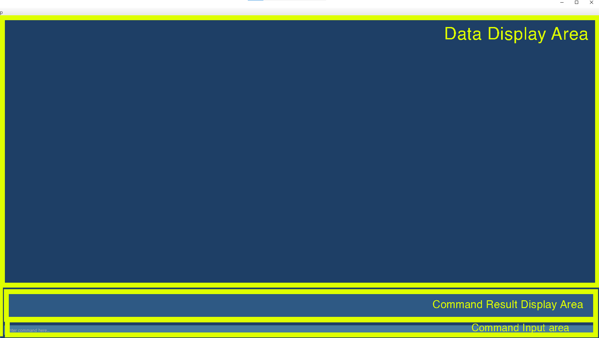

By: `Team Serenity` Since: `Aug 2020`

[1. Introduction](#1-introduction)

[2. Quick start](#2-quick-start)

[3. About](#3-about)

&nbsp;&nbsp;&nbsp;[3.1. Structure of this document](#31-structure-of-this-document)
    
&nbsp;&nbsp;&nbsp;[3.2. Reading this document](#32-reading-this-document)
   
&nbsp;&nbsp;&nbsp;&nbsp;&nbsp;&nbsp;[3.2.1. Terminology related to the _GUI_](#321-terminology-related-to-the-_gui_)
   
&nbsp;&nbsp;&nbsp;&nbsp;&nbsp;&nbsp;[3.2.2. General symbols and syntax](#322-general-symbols-and-syntax)
   
&nbsp;&nbsp;&nbsp;&nbsp;&nbsp;&nbsp;[3.2.3. Command syntax and usage](#323-command-syntax-and-usage)
   
&nbsp;&nbsp;&nbsp;&nbsp;&nbsp;&nbsp;[3.2.4. Command format](#324-command-format)

[4. Features](#4-features)

&nbsp;&nbsp;&nbsp;[4.1. Getting started](#41-setup)

&nbsp;&nbsp;&nbsp;&nbsp;&nbsp;&nbsp;[4.1.1. Add a new tutorial group from XLSX file: `addgrp`](#411-add-a-new-tutorial-group-from-xlsx-file-addgrp)
   
&nbsp;&nbsp;&nbsp;&nbsp;&nbsp;&nbsp;[4.1.2. Delete-an-existing-tutorial-group: `delgrp`](#412-delete-an-existing-tutorial-group-delgrp)

&nbsp;&nbsp;&nbsp;&nbsp;&nbsp;&nbsp;[4.1.3. Add a new tutorial lesson: `addlsn`](#413-add-a-new-tutorial-lesson-addlsn)

&nbsp;&nbsp;&nbsp;&nbsp;&nbsp;&nbsp;[4.1.4. Delete an existing tutorial lesson: `dellsn`](#414-delete-an-existing-tutorial-lesson-dellsn)

&nbsp;&nbsp;&nbsp;&nbsp;&nbsp;&nbsp;[4.1.5. Add a new student: `addstudent`](#415-add-a-new-student-addstudent)

&nbsp;&nbsp;&nbsp;&nbsp;&nbsp;&nbsp;[4.1.6. Delete an existing student: `delstudent`](#416-delete-an-existing-student-delstudent)

&nbsp;&nbsp;&nbsp;[4.2. Attendance taking](#42-attendance-taking)

&nbsp;&nbsp;&nbsp;&nbsp;&nbsp;&nbsp;[4.2.1. Mark all students as present: `markpresent`](#421-mark-all-students-as-present-markpresent-all)

&nbsp;&nbsp;&nbsp;&nbsp;&nbsp;&nbsp;[4.2.2. Mark a student as absent: `markabsent`](#422-mark-a-student-as-absent-markabsent)

&nbsp;&nbsp;&nbsp;&nbsp;&nbsp;&nbsp;[4.2.3 Mark a student as present: `markpresent all`](#423-mark-a-student-as-present-markpresent)

&nbsp;&nbsp;&nbsp;&nbsp;&nbsp;&nbsp;[4.2.4. Flag attendance of a student: `flagatt`](#424-flag-attendance-of-a-student-flagatt)

&nbsp;&nbsp;&nbsp;&nbsp;&nbsp;&nbsp;[4.2.5. Export attendance as XLSX file: `exportatt`](#425-export-attendance-as-xlsx-file-exportatt)

&nbsp;&nbsp;&nbsp;[4.3. Participation marking](#43-participation-marking)

&nbsp;&nbsp;&nbsp;&nbsp;&nbsp;&nbsp;[4.3.1. Add participation score of a student: `addscore`](#431-add-participation-score-of-a-student-addscore)

&nbsp;&nbsp;&nbsp;&nbsp;&nbsp;&nbsp;[4.3.2. Subtract participation score of a student: `subscore`](#432-subtract-participation-score-of-a-student-subscore)

&nbsp;&nbsp;&nbsp;&nbsp;&nbsp;&nbsp;[4.3.3. Export participation scores as XLSX file: `exportscore`](#433-export-participation-scores-as-xlsx-file-exportscore)

&nbsp;&nbsp;&nbsp;[4.4. Question addressing](#44-question-addressing)

&nbsp;&nbsp;&nbsp;&nbsp;&nbsp;&nbsp;[4.4.1. Add a new question: `addqn`](#441-add-a-new-question-addqn)

&nbsp;&nbsp;&nbsp;&nbsp;&nbsp;&nbsp;[4.4.2. Delete an existing question: `delqn`](#442-delete-an-existing-question-delqn)

&nbsp;&nbsp;&nbsp;[4.5. Utility viewing](#45-utility-viewing)

&nbsp;&nbsp;&nbsp;&nbsp;&nbsp;&nbsp;[4.5.1. View an existing tutorial group: `viewgrp`](#451-view-an-existing-tutorial-group-viewgrp)

&nbsp;&nbsp;&nbsp;&nbsp;&nbsp;&nbsp;[4.5.2. View an existing tutorial lesson: `viewlsn`](#452-view-an-existing-tutorial-lesson-viewlsn)

[5. FAQ](#5-faq)

[6. Command summary](#6-command-summary)

&nbsp;&nbsp;&nbsp;[6.1. Setup commands](#61-setup-commands)

&nbsp;&nbsp;&nbsp;[6.2. Attendance taking commands](#62-attendance-taking-commands)

&nbsp;&nbsp;&nbsp;[6.3. Participation marking commands](#63-participation-marking-commands)

&nbsp;&nbsp;&nbsp;[6.4. Question addressing commands](#64-question-addressing-commands)

&nbsp;&nbsp;&nbsp;[6.5. Utlity viewing commands](#65-utility-viewing-commands)

--------------------------------------------------------------------------------------------------------------------

## 1. Introduction

Welcome to the User Guide of **Serenity**!

Are you a tutor teaching CS2101 in NUS? Do you struggle to keep track of students' attendance and class participation
on many different excel sheets for different lessons? Do you also tend to forget to address questions students asked
during lessons? Fret not, our application, **Serenity**, will help keep you sane when doing the necessary administrative
work.

**Serenity** is a desktop application that helps CS2101 tutors manage their lessons. This application is optimized
for use through a _Command Line Interface (CLI)_, meaning that you operate the application by typing commands into a
command box. This application also has a _Graphical User Interface (GUI)_, where you can interact with the application
through graphical icons such as buttons.

This user guide serves to provide you with an in-depth documentation on how to set up and use our application.
With that said, let's get [started](#2-quick-start)!

--------------------------------------------------------------------------------------------------------------------

## 2. Quick start

To get started with using **Serenity**, you can follow these steps:

1. Ensure you have Java `11` or above installed in your Computer.

2. Download the latest `Serenity.jar` from [here]().

3. Copy the file to the folder you want to use as the home folder for your **Serenity** application.

4. Double-click the file to start the app. The _GUI_ similar to the image below should appear in a few seconds.

   

5. Type the command in the _Command Box_ and press `Enter` to execute it. 

6. Refer to the [Features](#4-features) below for details of each command.

--------------------------------------------------------------------------------------------------------------------

## 3. About

### 3.1. Structure of this document

This User Guide have been structured such that you can easily find what you need.

In [section 3.2](#32-reading-this-document), you can find useful tips on reading this document.

In [section 4](#4-features), you can find details of the three main features of **Serenity**:

* Attendance taking

* Participation marking

* Question addressing

### 3.2. Reading this document

In this subsection, you can find the explanation of the technical terms, symbols and syntax that are used in this
User Guide.

#### 3.2.1. Terminology related to the _GUI_

The following figure shows the _GUI_ of **Serenity**.
It is annotated with the name of the _GUI_ components.

#### 3.2.2. General symbols and syntax

The table below explains the general symbols and syntax used throughout the document.

Symbol/syntax | Meaning
--------|------------------
`command` | This indicates a technical term, which you can find out more in [Command syntax and usage](#323-command-syntax-and-usage).
_GUI_ | This indicates a graphical component, such as a button, layout format and text input box.
ℹ | This indicates a note.
💡 | This indicates a tip.
⚠ | This indicates a warning.

#### 3.2.3. Command syntax and usage

The table below explains some important technical terms.

Technical term | Meaning
--------|------------------
Command | The instruction that the user types into the command box for **Serenity** to perform a specific task.
Command word | The first word of the command that tells **Serenity** which task should be performed.
Parameter | The word or phrase following the command word that provides further details of the task (if necessary).
Prefix | The letter that is placed at the start of each parameter to distinguish one parameter from another.
XLSX | File format for all excel files.

#### 3.2.4. Command format

You can use commands to tell **Serenity** to perform a specific task.

**Format**:

`COMMAND_WORD prefix/PARAMETER`

> ℹ **Notes regarding the command format:**
>* Words in upper case are the parameters to be supplied by you. e.g. in `viewgrp grp/GROUP_NAME`, `GROUP_NAME` is a parameter which can be used as `viewgrp grp/G04`
>* Parameters have to be in the specified order. e.g. if the command specifies `grp/GROUP_NAME lsn/LESSON_NAME`, `lsn/LESSON_NAME grp/GROUP_NAME` is not acceptable.

**Example:**

If you need to add a new tutorial lesson, you can type the following command.

`addlsn grp/GROUP_NAME lsn/LESSON_NAME`

Analysis:

* Command: Add a tutorial lesson

* Command Word: `addlsn`

* Parameter: `GROUP_NAME`, `LESSON_NAME`

* Prefix: `grp/`, `lsn/`

--------------------------------------------------------------------------------------------------------------------

## 4. Features

This section contains all the information you need to know about the features of **Serenity**.
To use each feature or sub-feature, you will need to enter the command into the _Command Box_.
Below is an overview of the features availablie in **Serenity** :

1. [Setting up](#41-setting-up) feature provides you the tools to set up your tutorial groups and lessons.
2. [Attendance taking](#42-attendance-taking) feature provides you the tools to mark attendance for your lessons.
3. [Participation marking](#43-participation-marking) feature provides you the tools to grade student participation. 
4. [Question addressing](#44-question-addressing) feature provides you the tools to keep track of questions asked by students.

### 4.1. Setting Up

It is the start of the semester! Brand new classes, brand new students and a whole new experience.
Follow the instructions below to set up your new classes, and watch **Serenity** do the magic for you.

#### 4.1.1. Add a new tutorial group from XLSX file: `addgrp`

You can use this command to add a new tutorial group automatically from XLSX data.

> ℹ **Notes regarding the `addgrp` command:**
> * The XLSX file should store a list of students.
> * The format of the XLSX file should be the same as the XLSX file that you may download from LUMINUS.
> * To obtain PATH_TO_XLSX, either: 
>    ◦ Get the location of the XLSX file in your computer. 
>      e.g. `addgrp grp/G04 path/C:\Users\serene\CS2101_G04.xlsx` 
>    ◦ Copy and paste the XLSX file into the same folder as your **Serenity** application, then type the name of the XLSX file. 
>      e.g. `addgrp grp/G04 path/CS2101_G04.xlsx`

**Format:**

`addgrp grp/GROUP_NAME path/PATH_TO_XLSX`

**Example:**

You are adding a new tutorial group named `G04` to prepare for a new semester.
The XLSX data of the tutorial group is stored at `C:\Users\serene\CS2101_G04.xlsx`.

Adding a new tutorial group:

1. Type `addgrp grp/G04 path/C:\Users\serene\CS2101_G04.xlsx` into the _Command Box_.
2. Press `Enter` to execute.

Outcome:

1. The _Result Display_ will show a success message.
2. **Serenity** will switch to tutorial group `G04` page.
3. You can now see the list of students and a default list of tutorial lessons for tutorial group `G04`.

#### 4.1.2. Delete an existing tutorial group: `delgrp`

You can use this command to delete an existing tutorial group.

**Format:**

`delgrp grp/GROUP_NAME`

**Example:**

You accidentally added the wrong tutorial group `G04` and you decided to remove the tutorial group.

Deleting an existing tutorial group:

1. Type `delgrp grp/G04` into the _Command Box_.
2. Press `Enter` to execute.

Outcome:

1. The _Result Display_ will show a success message.
2. **Serenity** will exit tutorial group `G04` page.
3. You can now see that tutorial group `G04` no longer exists.

#### 4.1.3. Add a new tutorial lesson: `addlsn`

You can use this command to add a new tutorial lesson for a specified tutorial group.

**Format:**

`addlsn grp/GROUP_NAME lsn/LESSON_NAME`

**Example:**

You want to create a new tutorial lesson called `1-2` for tutorial group `G04`.

Adding a tutorial lesson to a tutorial group:

1. Type `addlsn grp/G04 lsn/1-2` into the _Command Box_.
2. Press `Enter` to execute.

Outcome:

1. The _Result Display_ will show a success message.
2. **Serenity** will display tutorial lesson `1-2` page.
3. You can now see that tutorial lesson `1-2` has been added to tutorial group `G04`.

#### 4.1.4. Delete an existing tutorial lesson: `dellsn`

You can use this command to delete an existing lesson from a specified tutorial group.

**Format:**

`dellsn grp/GROUP_NAME lsn/LESSON_NAME`

**Example:**

You accidentally added the wrong tutorial lesson `1-3` for tutorial group `G04` and you decided to remove it.

Deleting an existing lesson from a tutorial group:

1. Type `dellsn grp/G04 lsn/1-3` into the _Command Box_.
2. Press `Enter` to execute.

Outcome:

1. The _Result Display_ will show a success message. 
2. **Serenity** will exit tutorial lesson `1-3` page and enter tutorial group `G04` page.
3. You can now see that tutorial lesson `1-3` no longer exists.

#### 4.1.5. Add a new student: `addstudent`

You can use this command to add a new student to a tutorial group.

**Format:**

`addstudent grp/GROUP_NAME name/NAME id/STUDENT_ID`

**Example:**

A new student named `Aaron Tan` with student ID `A1234567U` entered your tutorial group,
and you want to add him to tutorial group `G04`.

Adding a new student to a tutorial group:

1. Type `addstudent grp/G04 name/Aaron Tan id/A1234567U` into the _Command Box_.
2. Press `Enter` to execute.

Outcome:

1. The _Result Display_ will show a success message.
2. `Aaron Tan` will be added to the list of students in tutorial group `G04`.

#### 4.1.6. Delete an existing student: `delstudent`

You can use this command to delete an existing student from a tutorial group.

**Format:**

`delstudent grp/GROUP_NAME name/NAME id/STUDENT_ID`

**Example:**

A student named `Aaron Tan` with student ID `A1234567U` dropped the CS2101 module,
and you need to remove him from the tutorial group `G04`.

Deleting an existing student from a tutorial group:

1. Type `delstudent grp/G04 name/Aaron Tan id/A1234567U` into the _Command Box_.
2. Press `Enter` to execute.

Outcome:

1. The _Result Display_ will show a success message.
2. `Aaron Tan` will no longer be in the list of students in tutorial group `G04`.

### 4.2. Attendance taking

Need to mark attendance of your students at the start of each lesson quickly?
This feature allows you to mark attendance of students easily.

#### 4.2.1. Mark all students as present: `markpresent all`

You can use this command to mark all students in a tutorial group as present for a tutorial lesson.

> 💡 **Tip for the `markpresent all` command:**
> You can conveniently mark all students as present at once in the beginning of the tutorial lesson,
> then mark some students as absent afterwards. You can then start your tutorial lesson without much hassle.

**Format:**

`markpresent all`

**Example:**

All students in group `G04` are present for your tutorial lesson `1-2` of tutorial group `G04`. 

Marking all students in a tutorial group as present for a tutorial lesson:

To mark all of them present at once:
1. Navigate to view group `G04` lesson `1-2` via [`viewlsn`](#452-view-an-existing-tutorial-lesson-viewlsn) command.
2. Type `markpresent all` into the *Command Box*.
3. Press `Enter` to execute.

Outcome:

1. The _Result Display_ will show a success message.
2. You can now see that all the students' attendance have been updated on the _Student Information Panel_.

_Figure 4.2.1. Outcome of a successful mark attendance for all students command_

#### 4.2.2. Mark a student as absent: `markabsent`

You can use this command to mark a specific student as absent for a tutorial lesson.

**Format:**

`markabsent name/NAME id/STUDENT_ID`

**Example:**

A student named `Aaron Tan` with student ID `A1234567U` is absent for your tutorial lesson `1-2` of tutorial group `G04`. 

To mark him absent:
1. Navigate to view group G04 lesson 1-2 via [`viewlsn`](#452-view-an-existing-tutorial-lesson-viewlsn) command.
2. Type `markabsent name/Aaron Tan id/A1234567U` into the *Command Box*.
3. Press `Enter` to execute.

Outcome:

1. The _Result Display_ will show a success message.
2. You can now see that his attendance has been updated on the _Student Information Panel_.

_Figure 4.2.2. Outcome of a successful mark a student absent command_

#### 4.2.3. Mark a student as present: `markpresent`

You can use this command to mark a specific student as present for a tutorial lesson.

**Format:**

`markpresent name/NAME id/STUDENT_ID`

**Example:**

A student named `Aaron Tan` with student ID `A1234567U` is present for your tutorial lesson `1-2` of tutorial group `G04`. 

Marking a student as present for a tutorial lesson:

To mark him present:
1. Navigate to view group G04 lesson 1-2 via [`viewlsn`](#452-view-an-existing-tutorial-lesson-viewlsn) command.
2. Type `markpresent name/Aaron Tan id/A1234567U` into the *Command Box*.
3. Press `Enter` to execute.

Outcome:

1. The _Result Display_ will show a success message.
2. You can now see that his attendance has been updated on the _Student Information Panel_.

_Figure 4.2.3. Outcome of a successful mark a student present command_

#### 4.2.4. Flag attendance of a student: `flagatt`

You can use this command to flag attendance of a specific student so you will be reminded to check the student's
attendance at the end of class.

**Format:**

`flagatt grp/GROUP_NAME lsn/LESSON_NAME name/NAME id/STUDENT_ID`

**Example:**

A student named `Aaron Tan` with student ID `A1234567U` from another tutorial group decided to join
your tutorial lesson `1-2` of tutorial group `G04`.
You want to flag his attendance and check with his tutor after your tutorial lesson. 

Flagging a student's attendance for a tutorial lesson:

1. Type `flagatt grp/G04 lsn/1-2 name/Aaron Tan id/A1234567U` into the _Command Box_.
2. Press `Enter` to execute.

Outcome:

1. The _Result Display_ will show a success message.
2. His attendance will now be flagged for future follow-up actions.

#### 4.2.5. Export attendance as XLSX file: `exportatt`

You can use this command to export the attendance sheet of a specific tutorial group as a XLSX file.

> 💡 **Tip for the `exportatt` command:**
> You can conveniently obtain the soft copy version of the attendance sheet for
> attendance list submission as part of NUS Centre for English Language Communication requirements.

> ℹ **Note regarding the `exportatt` command:**
> The attendance sheet will be saved as a XLSX file named after the tutorial group.
> The file will be saved at the same folder as your **Serenity** application.

**Format**:

`exportatt grp/GROUP_NAME`

**Example**:

You want to export the attendance sheet of tutorial group `G04`.

Exporting attendance sheet of a tutorial group:
1. Type `exportatt grp/G04` into the _Command Box_.
2. Press `Enter` to execute.

Outcome:
1. The _Result Display_ will show a success message.
2. The attendance sheet of tutorial group `G04` will be saved as `G04_attendance.xlsx`.
You can find the XLSX file at the location where your **Serenity** application is located.

### 4.3. Participation marking

Need to keep track of all your students' participation during lessons quickly? This feature allows you to key in a 
student's participation score easily with a scale for reference.

#### 4.3.1. Award participation score for a student: `addscore`
You can use this command to add the participation score for a specific student in a tutorial lesson.

With a scale from 1 to 5:

 | Score   | 1 | 2 | 3 | 4 | 5 |
 |---------|---|---|---|---|---|
 | **Remarks** |Very Poor|Poor|Sufficient|Good|Commendable|

> ⚠ **Warning regarding the `addscore` command:**
> You cannot increase the participation score of a student such that the final score is more than 5.
> The maximum score you can add is 5.

**Format:**
`setscore name/NAME id/STUDENT_ID add/SCORE`

**Example:**

In tutorial lesson `1-2` of tutorial group `G04`,
you noticed that your student named `Aaron Tan` with student ID `A1234567U` often participated in class discussions.
You decided to add `3` marks to his participation score for this tutorial lesson.

Adding participation score of a student in a tutorial lesson:
1. Navigate to view group G04 lesson 1-2 via [`viewlsn`](#452-view-an-existing-tutorial-lesson-viewlsn) command.
2. Type `setscore name/Aaron Tan id/A1234567U add/3` into the *Command Box*.
3. Press `Enter` to execute.

Outcome:

1. The _Result Display_ will show a success message.
2. You can now see that his score has been updated on the _Student Information Panel_.

#### Viewing statistics of class participation: `stats`

#### 4.3.2. Subtract participation score of a student: `subscore`

You can use this command to decrease the participation score of a specific student for a tutorial lesson.

> ⚠ **Warning regarding the `subscore` command:**
> You cannot decrease the participation score of a student such that the final score is less than 0.
> The maximum score you can subtract is 5.

**Format:**

`setscore name/NAME id/STUDENT_ID subtract/SCORE`

**Example:**

In tutorial lesson `1-2` of tutorial group `G04`,
you felt that your student named `Aaron Tan` with student ID `A1234567U` did not provide insightful responses to some questions.
You decided to subtract `1` mark from his participation score for this tutorial lesson.

Subtracting participation score of a student in a tutorial lesson:

1. Navigate to view tutorial lesson `1-2` of tutorial group `G04` via  command.
2. Type `subscore name/Aaron Tan id/A1234567U score/1` into the _Command Box_.
3. Press `Enter` to execute.

Outcome:

1. The _Result Display_ will show a success message.
2. You can now see that his score has been updated on the _Student Information Panel_.

#### 4.3.3. Export participation scores as XLSX file: `exportscore`

You can use this command to export the participation score sheet of a specific tutorial group as a XLSX file.

> ℹ **Note regarding the `exportscore` command:**
> The participation score sheet will be saved as a XLSX file named after the tutorial group.
> The file will be saved at the same folder as your **Serenity** application.

**Format:**

`exportscore grp/GROUP_NAME`

**Example:**

You want to collate the participation scores of tutorial group `GO7` into a XLSX file for grading on a 
different platform (i.e. LumiNUS).

Exporting participation score sheet of a tutorial group:

1. Type `exportscore grp/G07` into the _Command Box_.
2. Press `Enter` to execute.

Outcome:

1. The _Result Display_ will show a success message.
2. The participation score sheet of tutorial group `G04` will be saved as `G04_participation.xlsx`.
You can find the XLSX file at the location where your **Serenity** application is located.

### 4.4. Question addressing

Need to keep track of all your students' questions during lessons quickly? This feature allows you to key in questions
easily for future reference.

#### 4.4.1. Add a new question: `addqn`

You can use this command to add a question that was asked in a tutorial lesson, so that you can address the question
in the future.

**Format:**

`addqn qn/QUESTION`

**Example:**

A student asked you, "`What is the deadline for the report?`" in a tutorial lesson.
As the deadline of the report has changed, you want to note this question down, check the new deadline and
address the question in the future. 

Adding a question:

1. Type `addqn qn/What is the deadline for the report?` into the _Command Box_.
2. Press `Enter` to execute.

Outcome:

1. The _Result Display_ will show a success message.
2. The question will be added to the list of questions.

#### 4.4.2. Delete an existing question: `delqn`

You can use this command to delete a question after addressing it.

**Format:**

`delqn INDEX`

**Example:**

You addressed one of the questions at the end of a tutorial lesson and you want to delete the question from the
list of questions.

Deleting a question:

1. Type `delqn 1` into the _Command Box_.
2. Press `Enter` to execute.

Outcome:

1. The _Result Display_ will show a success message.
2. The question will be deleted from the list of questions.

### 4.5 Utility viewing

The following commands allow you to navigate between different views.

#### 4.5.1. View an existing tutorial group: `viewgrp`
You can use this command to view the list of students and tutorial lessons of an existing tutorial group.
You will also be able to execute tutorial group-related commands.

**Format:**

`viewgrp grp/GROUP_NAME`

**Example:**

You want to view the details of tutorial group `G04`.

Viewing a tutorial group:

1. Type `viewgrp grp/G04` into the _Command Box_.
2. Press `Enter` to execute.

Outcome:

1. The _Result Display_ will show a success message.
2. The _Data Display_ will update and display the information for tutorial group `G04`.

#### 4.5.2. View an existing tutorial lesson: `viewlsn`

You can use this command to view the attendance and participation scores of an existing
tutorial group. You will also be able to execute tutorial lesson-related commands.

**Format:**

`viewlsn grp/GROUP_NAME lsn/LESSON_NAME`

**Example:**

You want to view the details of tutorial lesson `1-2` of tutorial group `G04`.

Viewing a tutorial lesson:

1. Type `viewlsn grp/G04 lsn/1-2` into the _Command Box_.
2. Press `Enter` to execute.

Outcome:

1. The _Result Display_ will show a success message.
2. The _Data Display_ will update and display the students' information for tutorial lesson `1-2` of tutorial group `G04`.

--------------------------------------------------------------------------------------------------------------------

## 5. FAQ

**Q:** How many tutorial groups can I manage in **Serenity**?

**A:** You can manage more than 1 tutorial groups in **Serenity**.

**Q:** How do I transfer my data to another computer?

**A:** By default, **Serenity** saves all your data in a folder named `data`. This folder can be found in the
home folder for your **Serenity** application. You can copy and transfer the data folder into the home folder of
your **Serenity** application on your other computer. **Serenity** will automatically load your data upon launching.

--------------------------------------------------------------------------------------------------------------------

## 6. Command summary

### 6.1. Setup commands

Command | Example
------------ | -------------
**Add tutorial group**  `addgrp grp/GROUP_NAME path/PATH_TO_XLSX`| `addgrp grp/G04 path/C:\Users\serene\CS2101_G04.xlsx`
**Delete tutorial group**   `delgrp grp/GROUP_NAME`| `delgrp grp/G04`
**Add tutorial lesson**   `addlsn grp/GROUP_NAME lsn/LESSON_NAME` | `addlsn grp/G04 lsn/1-2`
**Delete tutorial lesson**   `dellsn grp/GROUP_NAME lsn/LESSON_NAME` | `dellsn grp/G04 lsn/1-3`
**Add student**   `addstudent grp/GROUP_NAME name/NAME id/STUDENT_ID` | `addstudent grp/G04 name/Aaron Tan id/A1234567U`
**Delete student**   `delstudent grp/GROUP_NAME name/NAME id/STUDENT_ID` | `delstudent grp/G04 name/Aaron Tan id/A1234567U`

### 6.2. Attendance taking commands

Command | Example
------------ | -------------
**Mark a student as present**   `markpresent name/NAME id/STUDENT_ID` | `markpresent name/Aaron Tan id/A1234567U`
**Mark a student as absent**   `markabsent name/NAME id/STUDENT_ID` | `markabsent name/Aaron Tan id/A1234567U`
**Mark all students as present**   `markpresent all` | `markpresent all`
**Flag attendance**   `flagatt grp/GROUP_NAME lsn/LESSON_NAME name/NAME id/STUDENT_ID` | `flagatt grp/G04 lsn/1-2 name/Aaron Tan id/A1234567U`
**Export attendance**   `exportatt grp/GROUP_NAME` | `exportatt grp/G04`

### 6.3. Participation marking commands

Command | Example
------------ | -------------
**Add participation score**   `addscore name/NAME id/STUDENT_ID score/SCORE` | `addscore name/Aaron Tan id/A1234567U score/3`
**Subtract participation score**   `subscore name/NAME id/STUDENT_ID score/SCORE` | `subscore name/Aaron Tan id/A1234567U score/1`
**Export participation scores**   `exportscore grp/GROUP_NAME` | `exportscore grp/G07`

### 6.4. Question addressing commands

Command | Example
------------ | -------------
**Add question**   `addqn qn/QUESTION` | `addqn qn/What is the deadline for the report?`
**Delete question**   `delqn INDEX` | `delqn 5`

### 6.5. Utility viewing commands

Command | Example
------------ | -------------
**View tutorial group**   `viewgrp grp/GROUP_NAME` | `viewgrp grp/G04`
**View tutorial lesson**   `viewlsn grp/GROUP_NAME lsn/LESSON_NAME` | `viewlsn grp/G04 lsn/1-2`
