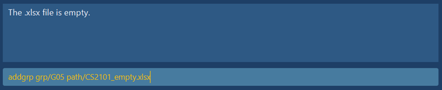

## Valid file formats

This section describes the file formatting which are accepted by Serenity.

### 1. Format of typical File downloaded from LumiNUS

Serenity accepts attendance sheet downloaded directly from LumiNUS. A typical attendance sheet downloaded
from LumiNUS looks like the one shown below.

   

   
<i>Figure 1. Typical attendance sheet downloaded directly from lumiNUS.</i>

   
A typical attendance sheet would contain the following :

1. Title 
2. Headers columns (Photo, Name, Student (matriculation) number, and the lessons that have been conducted)
3. student information 

However, if you would like to manually create your own attendance sheet to upload onto Serenity, it is 
**highly recommended** that you follow the same formatting as the above example to prevent errors . 

If you would like to deviate from the stated
format other valid file formats are described in the subsequent two sections and invalid file formats are described in the 
[_Invalid file format_](#Invalid-file-formats) section.

### 2. File without title

Serenity allows flexibility in the inclusion of title in the xlsx file provided. Below is an example of the format of a 
file without a title compared to the format of typical attendance sheet format downloaded from LumiNUS.

   

   
<i>Figure 2. Comparison in format between a file with no title and a typical file downloaded from LumiNUS.</i>

### 3. File without lessons 

Serenity also allows flexibility in the inclusion of lesson columns in the xlsx file provided. Below is an example of the format of a 
file without any lesson columns compared to the format of typical attendance sheet format downloaded from LumiNUS.

   

   
<i>Figure 3. Comparison in format between a file with no lesson column and a typical file downloaded from LumiNUS.</i>

---

## Invalid file formats

This section describes the file formatting which are rejected by Serenity. Should an invalid file be uploaded Serenity
will give an error message stating the possible errors of the file.

### 1. Empty file

Empty files are rejected by Serenity. Should you try to upload an empty file onto Serenity, Serenity will display an error 
message describing the error, an example is shown below.

   
<i>Figure 4.1. Serenity showing empty file error.</i>

### 2. No headers 

Files without header columns are rejected by Serenity, the example below is an example of a file without header columns compared to a file typically downloaded 
from LumiNUS

   

   
<i>Figure 5. Comparison in format between a file without header column and a typical file downloaded from LumiNUS.</i>

Should you try to upload a file without header column onto Serenity, Serenity will display an error message describing the error, an example is shown below

   

   
<i>Figure 5.1. Serenity showing invalid header error.</i>

### 3. incorrect headers 

Similar to files without headers, files with correct headers but in the wrong order are rejected by Serenity, the example below
is an example of a file with correct headers but in the wrong order compared to a file typically downloaded from LumiNUS.

   

   
<i>Figure 6. Comparison in format between a file with correct headers but in the wrong order and a typical file downloaded from LumiNUS.</i>

Should you try to upload a file with  correct headers but in the wrong order onto Serenity, Serenity will display an error message describing the error, an example is shown below

   

   
<i>Figure 6.1. Serenity showing invalid header error.</i>

### 4. Missing student details in file

Students are the cornerstone of every tutorial group, therefore, files with student information missing will be rejected by Serenity, the example below
is an example of a file without student information compared to a file typically downloaded from LumiNus.

   

   
<i>Figure 7. Comparison in format between a file with missing student information and a typical file downloaded from LumiNUS.</i>

Should you try to upload a file with missing student information onto Serenity, Serenity will display an error message describing the error, an example is shown below

   

   
<i>Figure 7.1. Serenity showing no student error.</i>

